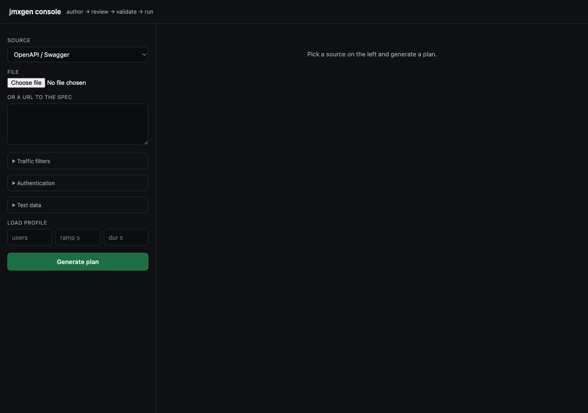
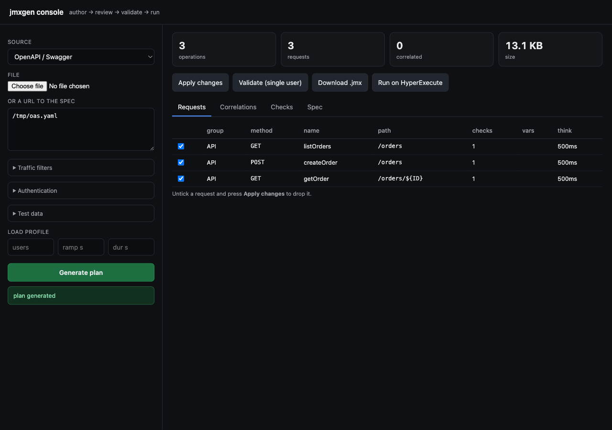
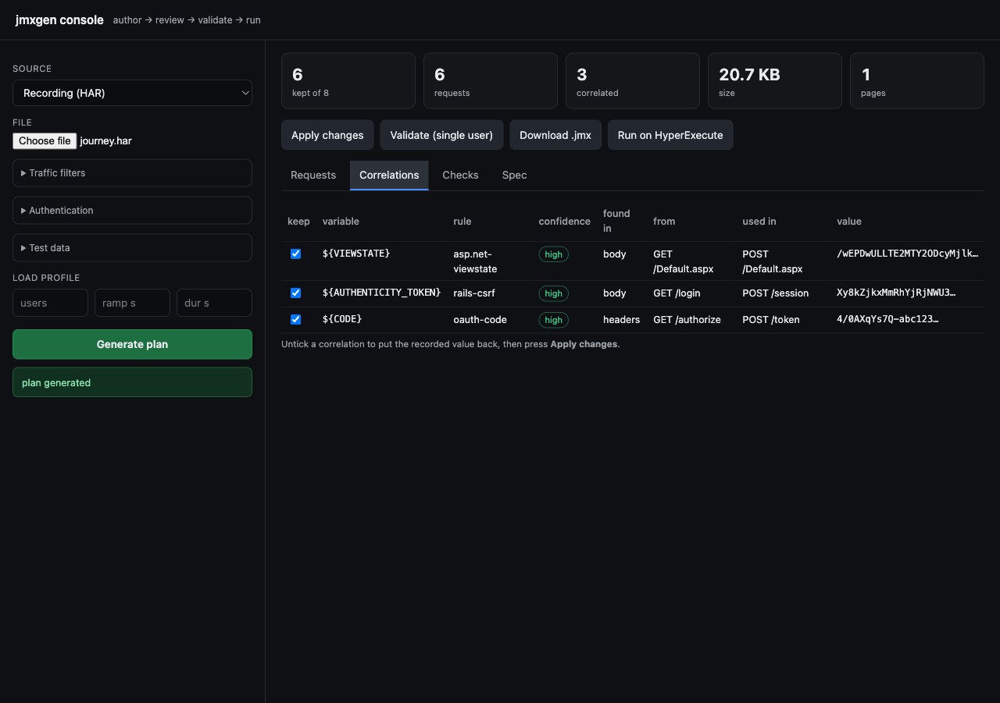
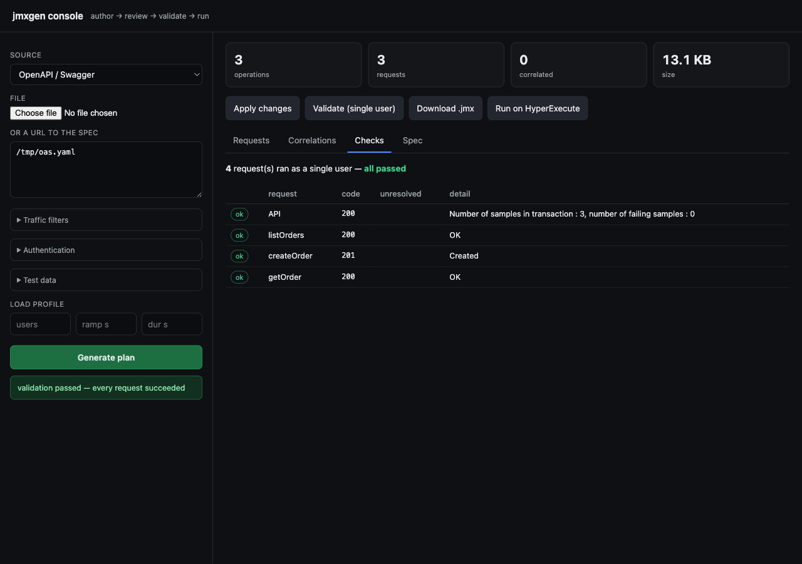
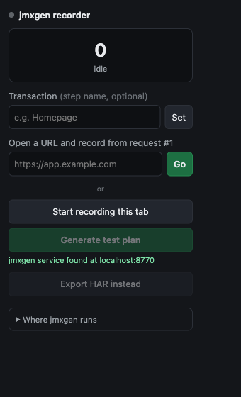
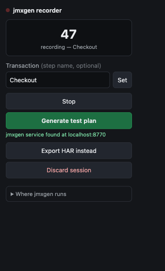
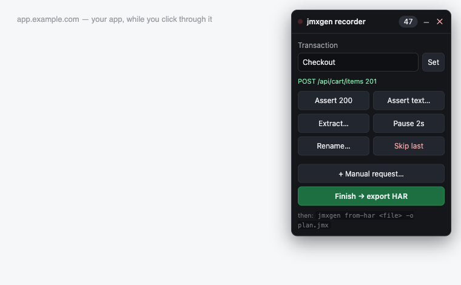

# jmxgen — getting started

Author a ready-to-run JMeter `.jmx` from an OpenAPI spec, a Postman collection, a
spreadsheet, a URL list, or a real browser session — with dynamic tokens already wired
up, and proof it works before you put load on anything.

There are two front doors: the **app** (binary + web console + CLI) and the **Chrome
recorder extension**. This file is the short version; the full illustrated guide is
[JMXGEN_GUIDE.html](JMXGEN_GUIDE.html) — open it in a browser.

---

## What you need

| Component | Needed? | Unlocks | How to get it |
|---|---|---|---|
| The jmxgen bundle | **required** | All authoring, the console, the API | Unzip it. Nothing to install. |
| Java 11+ | **required to run** | JMeter itself | `brew install openjdk@11` |
| Apache JMeter | **required to run** | `replay`, `verify --deep` — the validation gates | `brew install jmeter` |
| Chrome or Edge | for the extension | Recording with your own profile / SSO / MFA | already installed |
| Playwright | optional | `record` — headless or manual browser capture | `pip install playwright && python3 -m playwright install chromium` |
| mitmproxy | optional | `capture` — Postman, mobile, desktop, backend traffic | `pip install mitmproxy` |
| LambdaTest keys | optional | Running on HyperExecute | `LAMBDATEST_USERNAME`, `LAMBDATEST_ACCESS_KEY` |

**Authoring needs nothing but the bundle** — no Python, no pip, no virtualenv.

One command tells you exactly what is present and what to install:

```
$ ./jmxgen-macos/jmxgen doctor

== jmxgen doctor ==
  . python                          3.9.6                  everything
  . PyYAML                          installed              YAML specs and rule files
  . openpyxl                        installed              Excel input (.xlsx)
  . requests                        installed              running on HyperExecute
  X Playwright                      missing                `record` - headless / manual browser capture
                                    pip install playwright && python3 -m playwright install chromium
  . mitmproxy                       installed              `capture` - mobile / desktop / Postman / backend traffic
  . Java                            openjdk version "11.0. JMeter itself
  . JMeter                          /opt/homebrew/bin/jmet `verify --deep` and `replay` - the validation gates
  1 optional component(s) missing - each only limits the feature listed
```

---

## Install

```bash
unzip jmxgen-macos.zip
./jmxgen-macos/jmxgen doctor
```

The first run takes a few seconds while macOS scans the bundle once; every run after
that starts in ~0.2s. If macOS blocks it, clear the download quarantine flag once:

```bash
xattr -dr com.apple.quarantine jmxgen-macos
```

Build it yourself with `./build_binary.sh`. It is a **folder, not a single file**, on
purpose: a one-file bundle unpacks into a new temp directory on every run and macOS
re-scans every extracted file each time — about five seconds per command. Bundles are
per-platform; build on macOS for macOS, Linux for Linux, Windows for the `.exe`.

If the target machine already has Python 3.8+, `./build_bundle.sh` produces
`dist/jmxgen`, a single 144 KB file that runs anywhere.

---

## Track A — the app

### The console

```bash
./jmxgen-macos/jmxgen console        # opens http://localhost:8770
```



1. **Pick a source** — OpenAPI, Postman, HAR, cURL, Excel/CSV, a URL list, or an
   existing `.jmx` to import. Upload a file or paste a URL.
2. **Generate plan.** The tiles at the top are the summary to read first: requests kept,
   requests dropped, values correlated, plan size.

   

3. **Review what it decided.** The Correlations tab shows every dynamic value, which rule
   matched, the confidence, and exactly where the value came from and where it is used.
   Untick anything you disagree with and press *Apply changes*.

   

4. **Validate (single user)** — the plan runs once, for real, against the real target.

   

5. **Download .jmx**, or **Run on HyperExecute**.

### The same thing on the CLI

```bash
# recording -> plan, with correlation
$ jmxgen from-har journey.har -o flow.jmx --mode web --real-think-time

kept 7 of 8 recorded requests across 1 page(s) (dropped 0 static, 1 third-party, 0 filtered)
  correlated 3 value(s):
    ${VIEWSTATE}             asp.net-viewstate  high      from body     GET /Default.aspx -> POST /Default.aspx
    ${AUTHENTICITY_TOKEN}    rails-csrf         high      from body     GET /login       -> POST /session
    ${CODE}                  oauth-code         high      from headers  GET /authorize   -> POST /token
wrote flow.jmx
  VALID - ready to run

# the gate
$ jmxgen replay flow.jmx
  ran 3 sampler(s) as a single user
  PASS - every request succeeded and every variable resolved
```

| Command | What it does |
|---|---|
| `jmxgen doctor` | What is installed and what it unlocks. Run this first. |
| `jmxgen console` | Open the web console on port 8770. |
| `jmxgen from-openapi` | OpenAPI / Swagger file or URL → `.jmx` |
| `jmxgen from-har` | Any browser recording → `.jmx`, with correlation |
| `jmxgen from-postman` | Postman collection → `.jmx` |
| `jmxgen from-excel` | Spreadsheet → `.jmx` (`jmxgen template` writes the sheet) |
| `jmxgen probe` | A list of page URLs and nothing else → `.jmx` |
| `jmxgen verify` | Valid and loadable? `--deep` asks JMeter itself. |
| `jmxgen replay` | Run once as one user and diagnose what broke. |
| `jmxgen optimize` | Repair and slim a plan you already have. |
| `jmxgen ship` | Author and run on HyperExecute in one step. |

---

## Every control in the console

### Source — the dropdown at the top

The only choice you must make. It decides what input the console asks you for.

| Option | It wants | Use it when |
|---|---|---|
| **OpenAPI / Swagger** | a file **or a URL** (`.yaml`, `.json`) | Your API has a contract. Paste the live spec URL (`/v3/api-docs`, `/swagger.json`) and get a plan with zero recording. Path parameters become `${VARIABLES}`, not frozen example values. |
| **Postman collection** | a file (`.json`, v2.1 export) | QA already built the calls. Folders become Transaction Controllers; Postman's variable chaining (`pm.environment.set` → `{{token}}`) survives into JMeter extractors. |
| **Recording (HAR)** | a file (`.har`) | You captured a session — extension, DevTools *Network → Export HAR*, Charles, Fiddler. **The only source where correlation has anything to work with**, because it's the only one containing real responses. |
| **cURL command(s)** | pasted text | You want two or three specific calls. DevTools → *Copy as cURL*. Multiple commands in one paste become multiple requests. Handles `-X -H -d -F -u`. |
| **Excel / CSV sheet** | a file (`.xlsx`, `.csv`) | The endpoint list lives in a spreadsheet. `jmxgen template` writes the sheet with the right columns to hand to a colleague. |
| **Page URL list (probe)** | pasted text, one URL per line | You have nothing — no spec, no recording. It fetches each page, reads the HTML for scripts, styles, images and forms, and builds a page-load plan. |
| **Existing .jmx (import)** | a file (`.jmx`) | Someone hands you a plan another tool generated. Turns it back into an editable spec. Pair with `optimize` for bloated or broken plans. |

**Which one?** If your API has a spec, use **OpenAPI** — fastest, and stays correct as the API
changes. If the journey involves logging in through a browser, use the **extension** and land
on **Recording (HAR)**. The rest are conveniences for input you already have.

### Traffic filters — what to keep

Only relevant for sources containing more than you want: a recording, or a probed page.

| Control | What it does |
|---|---|
| **Keep: auto** | **The default, right most of the time.** Keeps pages and service calls, drops static assets and known trackers. |
| **Keep: api** | **Service calls only.** Drops documents, images, scripts, stylesheets — leaves XHR/fetch. This is how a browser recording becomes a pure API load test. |
| **Keep: web** | **Everything the browser fetched**, assets included. For load-testing page delivery — CDN, cache headers, asset weight. |
| **Methods** | Blank = every verb. `POST,PUT` keeps only writes. |
| **Include (regex)** | Keep only URLs matching, e.g. `/api/`. Applied after Keep. |
| **Exclude (regex)** | Drop URLs matching, e.g. `analytics\|beacon\|hotjar`, even if they survived everything else. |
| **Use recorded think times** | Off by default (flat 500 ms). On, it uses the real gaps between your clicks — realistic, but a two-minute pause while you read is now in the plan. |

### Authentication — logging in once, for everyone

Most APIs reject everything without a token. Fill these three and the plan gets a login that
runs **once**, before the test, with the token shared across every virtual user.

| Field | Example |
|---|---|
| **Login request** | `POST /oauth/token` |
| **Body** | `{"grant_type":"client_credentials"}` (blank for a GET-style login) |
| **Token path** | `$.access_token` — every later request gets `Authorization: Bearer ${TOKEN}` |

It becomes a **setUp Thread Group**, and the token is published as a JMeter *property*, not a
variable — variables are per-thread, so a token extracted by user 1 is invisible to users 2
through 500. Getting this wrong is the most common reason a plan returns a wall of 401s under
load but works perfectly with one user. If you want each user logging in separately, leave this
closed and record the login as a normal step.

### Test data — so 500 users aren't all "bob"

| Field | What it does |
|---|---|
| **CSV file** | Path, e.g. `users.csv`. **Not uploaded** — referenced by name, so keep it next to the `.jmx`. `verify` warns if it's missing. |
| **Columns** | `username,password` → `${username}`, `${password}`. Wire them into the login body or any request. |

Without this every user sends identical payloads, your database caches everything, and the
numbers are fiction.

### Load profile

| Field | What it does |
|---|---|
| **users** | Concurrent virtual users. Blank = 1, correct while still building the plan. |
| **ramp s** | Seconds to reach full load. 500 users arriving at once measures your connection pool, not your app. Roughly one second per user is a fine start. |
| **dur s** | How long to hold that load. Under a minute mostly measures JIT warm-up. |

All three are plain fields in the `.jmx` and can be changed later without regenerating; on
HyperExecute `--concurrency` and `--duration` override them at run time.

### The buttons and tabs

| | |
|---|---|
| **Apply changes** | Re-generates after you untick requests or reject correlations. Your source isn't re-read, only your decisions re-applied. |
| **Validate (single user)** | Runs the plan once against the real target. **The gate.** Needs JMeter. |
| **Download .jmx** | The finished file. |
| **Run on HyperExecute** | Creates the project, uploads, triggers, monitors. Needs LambdaTest credentials. |
| *Requests* tab | Every request in the plan — group, method, path, assertions, think time. Untick to drop. |
| *Correlations* tab | Every dynamic value, the rule, the confidence, and where it flows from and to. Untick to restore the literal. |
| *Checks* tab | Empty until you validate. Then one row per request with the live response code. |
| *Spec* tab | The whole plan as YAML. **Read-only in the console today** — copy it out, edit, and rebuild with `jmxgen build spec.yaml -o plan.jmx`. This is where you add what the UI can't yet express, like chaining an id from one response into a later request. |

---

## Track B — the Chrome extension

Use it when the journey needs *your* browser — your profile, your SSO, your VPN, your
MFA. A headless recorder cannot log in as you.

### Install

1. `chrome://extensions` → turn on **Developer mode**
2. **Load unpacked** → select the `jmxgen-recorder/` folder
3. Pin it so the toolbar icon is visible
4. Leave `jmxgen console` running — the extension hands its recording to it

Managed Chrome profiles usually block unpacked extensions; force-install with the
`ExtensionSettings` policy, or publish to the Web Store (`./package.sh` builds the zip).

Firefox is not supported and it is not a matter of effort — Firefox does not implement
`chrome.debugger`, so response bodies cannot be captured, and correlation needs them.
Use `jmxgen record` or `jmxgen capture` there.

### Record

| | |
|---|---|
|  |  |

**Type the URL into the popup and press Go.** The extension opens the page itself and
attaches before the first byte, so the initial document load and every API call the page
fires on boot are captured. If you open the page first and *then* press record, the auth
handshake and the first token are already gone. *Start recording this tab* exists for
when you are already deep in a flow.

Then just use the site. Popups and OAuth redirects are followed; redirect chains are kept
as separate hops.

### Author steps while you browse



| Control | What it writes into the plan |
|---|---|
| **Transaction** | Every request from now on lands in this Transaction Controller |
| **Assert 200** | Response assertion on the last request |
| **Assert text…** | "body contains …" assertion on the last request |
| **Extract…** | JSON extractor on the last response — `$.data.token` → `${TOKEN}` |
| **Pause 2s** | Flow Control Action pause after that request |
| **Rename…** | The sampler label |
| **Skip last** | Drops that request from the plan |
| **+ Manual request…** | A request you type in by hand — never observed, purely authored |

Everything is written into the exported HAR under `_jmxgen` keys — a custom field the HAR
spec allows, so the file stays a valid HAR any other tool will still open.

**Generate test plan** sends the recording to the console and opens it there, correlations
already computed. If the service is not running, **Export HAR instead** and finish on the
CLI:

```bash
jmxgen from-har jmxgen-session-*.har -o plan.jmx
jmxgen replay plan.jmx
```

Chrome shows *"jmxgen recorder started debugging this browser"* while recording. That is
the DevTools protocol attaching — the only API that exposes response bodies, which is what
correlation reads. Closing the banner stops the recording.

---

## The two gates

- **`verify`** — *is this a real JMeter file?* Well-formed XML, correct element/hashTree
  pairing, referenced data files present, no undefined variables. `--deep` asks JMeter
  itself to load it. Fast, no network, safe in CI.
- **`replay`** — *does it actually work?* Runs the plan once as a single user against the
  real target. Reports every response code, every failed assertion, and every variable
  that never resolved.

Both matter, because a plan can pass every static check and still be broken:

```
$ jmxgen verify broken.jmx
  .  well-formed XML, 2 thread group(s), 3 sampler(s)
  VALID - ready to run          <- valid XML, JMeter loads it, looks fine

$ jmxgen replay broken.jmx
  !  listOrders      sent NOT_FOUND - a correlation did not resolve
  !  createOrder     sent NOT_FOUND - a correlation did not resolve
  X  listOrders      401  Test failed: code expected to equal /200/
  FAIL - 3 failing sampler(s), 2 with unresolved variables
```

---

## Running the finished plan

Locally — the plan is ordinary JMeter 5.6.3, no runtime and no lock-in:

```bash
jmeter -n -t plan.jmx -l results.jtl -e -o report/
```

On HyperExecute — authors, verifies, creates the project, uploads, triggers, monitors,
downloads artifacts:

```bash
export LAMBDATEST_USERNAME=...  LAMBDATEST_ACCESS_KEY=...

jmxgen ship --jmx plan.jmx --data users.csv \
    --project-name "Orders API" --concurrency 25 --duration 600

# or author straight into a run
jmxgen ship from-openapi api.yaml \
    --author "--auth 'Bearer ${TOKEN}' --include /orders" \
    --project-name "Orders API" --concurrency 10 --regions eastus
```

Add `--no-run` to stop after authoring and verification.

---

## Troubleshooting

| Symptom | Fix |
|---|---|
| First run is slow | Expected, once — macOS scans the bundle. Later runs take ~0.2s. |
| "Developer cannot be verified" | `xattr -dr com.apple.quarantine jmxgen-macos` |
| Port 8770 in use | The console names the process holding it and the command to stop it. Or `jmxgen console --port 8880`, and set the same address in the popup under *Where jmxgen runs* |
| The console vanished | It stops itself after 60 min with no requests, so a forgotten window never holds the port. Restart it, or use `--idle-timeout 0` |
| Popup can't find the service | Console isn't running, or it's on another port. *Export HAR instead* works either way. |
| "Cannot access a chrome:// URL" | Chrome forbids attaching to its own pages. Type the target URL into the popup and press **Go**. |
| Recording missed the page load | You pressed record after opening the page. Use the URL field + **Go**. |
| `replay` says a variable didn't resolve | An extractor stopped matching. Check the Correlations tab — the response probably changed shape. |
| Plan targets the wrong domain | Third-party traffic dominated the recording. Use the traffic filters, or `--mode api`. |
| Recording is huge | `--mode api` drops assets and pages; `optimize` slims a plan you already have. |

---

Full reference: [../JMXGEN_README.md](../JMXGEN_README.md)
