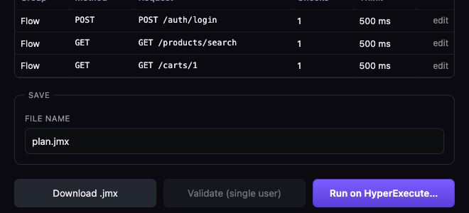
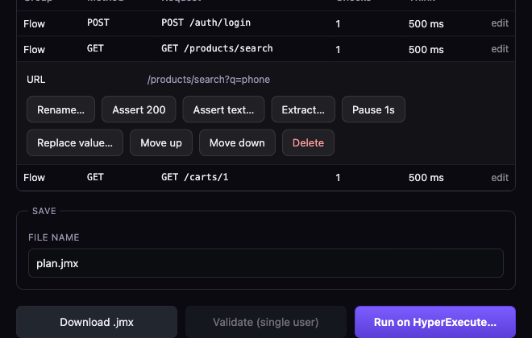

# Every option, and what it does

One page for every control in the extension, each with a worked example. The
defaults are chosen to be right most of the time, so treat this as reference
rather than a checklist: you can author a good plan without touching any of it.

- [The authoring page](#the-authoring-page)
  [Source](#source) · [From the recording](#from-the-recording) ·
  [Traffic filters](#traffic-filters) ·
  [Authentication](#authentication) · [Test data](#test-data) ·
  [Load profile](#load-profile) · [What comes out](#what-comes-out)
- [The popup](#the-popup)
  [Starting a recording](#starting-a-recording) · [Transaction](#transaction) ·
  [Recording options](#recording-options) · [While it is recording](#while-it-is-recording) ·
  [Finishing](#finishing)
- [The panel on the page](#the-panel-on-the-page)

## A note on the grey text

Every field's grey text describes the field or names what happens when you
leave it blank. **It is never an example value and never a default you are
about to send.** If a field looks filled in but the text is grey, the field is
empty.

Where blank means something specific:

| Field | Blank means |
|---|---|
| Users, Ramp | 1 |
| Duration (authoring page) | each user loops once and stops |
| Plan file name | `plan.jmx` |
| Methods | every method |
| Include, Exclude | no filtering |
| Max users, Ramp-up, Duration (run page) | whatever the `.jmx` carries, often 1 user |
| Max users per engine | prefilled with 2000; clear it and HyperExecute's own default applies |
| Global timeout, Job label | not sent |
| Existing project id | a project is created from the name |
| Where jmxgen runs | `localhost:8770` |

Everything else is genuinely optional, and the examples that used to sit in
these boxes are in the sections below instead, where they can be explained.

---

# The authoring page

## Source

*Where the requests come from.* Seven of them, covered one by one in
[SOURCES.md](SOURCES.md) with a sample file each. The choice changes which input
appears below it: a file picker, a text box, or both.

## From the recording

Shown only when you are authoring from something you recorded. An hour-long
session is authored by choosing the parts of it you want.

### The transaction list

Every transaction you named while recording, with what it holds:

```
Login           2 requests · 2 not assets
Search          1 requests · 1 not assets
Idle polling   12 requests · 12 not assets
```

Untick what this plan should leave out. The recording itself is untouched, so
you can author a different plan from the same session a minute later.

**Example.** A two-hour session where you spent forty minutes reading
documentation with a dashboard open in another tab. Tick Login, Search and
Checkout; leave the polling behind. You get a plan someone would actually run
instead of three thousand samplers.

### Collapse repeated requests into one sampler

On by default.

**Example.** An hour with the app open polls `GET /api/notifications` four
hundred times. Collapsed, that is one sampler. Left alone, it is four hundred
samplers and a `.jmx` measured in megabytes, describing a test nobody meant to
write.

Requests count as repeats when the method, URL and body all match.

### What is dropped whatever you choose

CORS preflights. A browser sends `OPTIONS` before a cross-origin call because
its security model requires it; JMeter has no such model and never sends one.
A preflight sampler would measure a request that does not happen under load,
and double the request count of every cross-origin API. They are recognised by
the `Access-Control-Request-*` header rather than by the method, so an
`OPTIONS` endpoint you actually mean to test is kept.

## Traffic filters

These only appear for the two sources that carry more than you asked for: a
recording, and a URL list. A curl command has no noise to remove.

### Keep

What counts as part of the test.

| Value | What it keeps | When to pick it |
|---|---|---|
| `auto` | pages and service calls, no assets | the default, and right for most APIs |
| `api` | service calls only | you are load-testing an API, and the HTML is irrelevant |
| `web` | everything the browser fetched | page load time is the thing you are measuring |

**Example.** The sample recording holds 58 requests. The same file, authored
three ways:

| Keep | Kept | What went |
|---|---|---|
| `api` | 3 | 42 static, 13 third-party |
| `auto` | 4 | 36 static, 18 third-party |
| `web` | 26 | 32 third-party |

`api` gives a plan where every number in the report is about your service.
`web` keeps the assets your own domain served, so the plan measures what a page
load costs, while still refusing to load-test somebody else's CDN. `auto` sits
between: the page itself plus its service calls.

The trap `auto` and `api` exist to avoid: with assets included, 500 users mostly
hammer a CDN, average response time collapses to 12 ms, and the report says the
system is healthy when the API underneath is timing out.

### Methods

A comma-separated allow-list. Blank means all.

**Example.** `GET` on a recording of a checkout flow gives you a read-only plan
you can point at production without creating 500 real orders.

### Include (regex)

Keep only URLs matching this pattern.

**Example.** `/api/v2/` on a recording made while the app was mid-migration
keeps the new endpoints and drops the v1 calls the old pages still make.

### Exclude (regex)

Drop URLs matching this pattern, applied after Include.

**Example.** `analytics|beacon|hotjar|intercom` removes the third-party
telemetry that a `web` recording would otherwise load-test on someone else's
behalf. `\.(png|jpe?g|svg|woff2?)$` drops images and fonts while keeping the
rest of a `web` capture.

### Skip correlation

Off by default. On, dynamic values are left exactly as recorded.

**Example.** You are testing a stateless public API where the "tokens" the
correlator spotted are actually product ids that must stay fixed. Turning it on
stops the plan from replacing them with `${VARIABLES}`.

Most of the time, leaving this off is what makes the plan work at all: replayed
verbatim, a recorded session token has already expired.

## Authentication

Three fields that turn one recorded login into a login that runs once per virtual
user, correctly, under load.

| Field | Example |
|---|---|
| Login request | `POST /auth/login` |
| Body | `{"username":"${username}","password":"${password}"}` |
| Token path | `$.accessToken` |

**What it builds.** The login moves into a setUp Thread Group. The token is
extracted with the JSONPath you gave and published as a JMeter *property* with
`props.put("AUTH_TOKEN", …)`, then read back in every request as
`Bearer ${__P(AUTH_TOKEN)}`.

**Why a property and not a variable.** Variables are per-thread. A token
extracted by user 1 is invisible to users 2 through 500, so a plan built the
obvious way works perfectly in a single-user test and returns a wall of 401s
under load. This is the most common way a JMeter plan fails.

Leave these blank if the recording already carries a login and correlation found
the token. The Correlations tab tells you whether it did.

## Test data

| Field | Example |
|---|---|
| CSV file | `users.csv` |
| Columns | `username,password` |

The columns become `${username}` and `${password}`, and each virtual user reads
its own row.

**Example.** Without this, 500 users log in as `emilys`, the account is locked
out or its cache is warm, and the numbers describe one user's experience
repeated 500 times. With it, they behave like 500 people.

The path is resolved relative to the `.jmx`, so keep the CSV beside the plan.
Upload it with the plan on the run page, and tick *Split CSV rows across engines*
so no two machines replay the same rows.

## Load profile

| Field | Example | Meaning |
|---|---|---|
| Users | `50` | virtual users |
| Ramp (s) | `60` | how long until all of them are running |
| Duration (s) | `600` | how long to hold. Blank means each user loops once and stops |

**Example.** `50 / 60 / 600` starts roughly one new user a second for a minute,
then holds 50 for ten minutes. Ramping matters: 50 users starting at once
produces a thundering herd, and you end up measuring the cold start rather than
the system.

Blank duration is the right choice when you are checking the plan works, not
measuring anything.

These are a starting point. The HyperExecute run form overrides all three, so
what you set here is what a local JMeter run would use.

### Use the think times from the recording

**On by default, for recordings.** It appears under Load profile whenever the
source is a recording, because it shapes load rather than filtering traffic.

On, the plan carries the gaps that actually occurred while you browsed, as a
timer after each request. Off, the plan has no timers at all: every user
replays the journey as fast as the server can answer, which is a stress test
rather than a load test. Two users with no pacing generate more traffic than
fifty behaving like people, and it will pin a CPU on a small engine.

**When to turn it off.** You paused for 47 seconds mid-recording to read a
Slack message, and that pause is now in the plan, so 500 users each sit idle
for 47 seconds and throughput collapses. Either re-record cleanly, or turn this
off and pace the test with the load profile instead.

## What comes out

*Plan file name* is the filename the `.jmx` is saved and uploaded under. It
matters more than it looks: it is the name the run form offers as the entry
point, so `checkout-load.jmx` is easier to pick out of a project than `plan.jmx`
for the fourth time.

| Button | What you get | Needs | When to use it |
|---|---|---|---|
| Download .jmx | the plan | nothing | always, if you want to keep it or open it in JMeter |
| Validate (single user) | one real run, per-request codes, and any `${VAR}` that never resolved | the local console | before any run that costs money |
| Run on HyperExecute… | project, upload, trigger, dashboard | LambdaTest credentials | when the plan is ready to carry load |
| Download Taurus .yml | the same test as a `bzt` config | `bzt`, if you use it | when your CI already speaks Taurus |
| Download browser test .py | the browser steps as a Playwright script | Playwright, if you run it | when the journey's UI matters as well as its load |

Download and *Run on HyperExecute…* both parse the plan first. A plan that no
XML parser will read is refused here, with the line and column, rather than
failing on a runner ten minutes later.

Three tabs sit above them. *Requests* is every sampler with its group, method,
path and checks: read it to confirm the plan contains what you meant to test.
*Correlations* is every dynamic value that was wired between requests, with the
rule, a confidence and the hop, so you can disagree with one. *Checks* holds
validation results once you have run one.

### Editing the plan

It lives in the **Requests** tab, on the result page. Every row is clickable,
and says so on the right:



Click any row and the request opens, with the verbs underneath it:



```
Rename…   Assert 200   Assert text…   Extract…   Pause 1s   Move up   Move down   Delete
```

Above them sits the request itself: the URL, the headers, and the body the
sampler will send. A plan you cannot read is one you cannot edit with any
confidence, so the inspector opens with what is actually going over the wire.

```
Rename…  Assert 200  Assert text…  Extract…  Pause 1s  Replace value…  Move up  Move down  Delete
```

They are the same verbs the recording panel uses, and they do the same things.
Each one edits the spec and rebuilds the plan, so an edited plan is exactly what
the spec says and goes through the same checks as a freshly authored one.

**Replace value…** swaps a literal for a `${VARIABLE}`, everywhere in the plan
rather than only in the request you clicked. A recorded token appears in every
request that used it, and replacing it in one place leaves the others holding a
value that expired when recording stopped.

It matches whole values only. Replacing `emilys` does not touch `emilyspass` —
that substring rewrite would corrupt a password while reporting success. The
message says how many places changed.

Expect a warning afterwards: a variable nothing defines yet is *expected* at
this point, not a mistake. Define it under Test data from a CSV, or with
Extract on an earlier request, and the warning goes.

**An edit that breaks something says so.** Delete a request another one takes a
token from and the message reads *"delete applied, but it broke something:
variable ${ACCESSTOKEN} is used but never defined"*, and the Checks tab opens.
That plan would still build and still run; it would fail at load with a wall of
401s. A warning that only appeared in the log would make this editor a way to
break a plan quietly.

### Advanced — edit the spec

The plan is generated from a spec, and the spec is in a box at the bottom of the
page. Everything the engine can build is reachable there, including the things
the form deliberately does not carry: database steps, GraphQL samplers, JSR223
scripting, the other four timer types, and if/loop/parallel controllers.

Edit it, press **Regenerate from the spec**, and the result goes through the
same validation as anything else. A spec that cannot be read says why rather
than failing silently.

Most people will never open this. It exists so the form does not need a field
for every feature.

The Log panel underneath holds everything the engine did. **copy** puts it on the
clipboard, **clear** empties it, **hide** collapses it.

*Where jmxgen runs* is the address of the optional local console, and only
Validate uses it. Everything else runs inside the extension.

---

# The run page

Reached with *Run on HyperExecute…*, from either the popup or the authoring
page. [SETUP.md](SETUP.md#5-running-it-on-hyperexecute) walks the five steps it
performs in order; this is what each control is for.

## Credentials

| Control | What it does | When to use it |
|---|---|---|
| Username | your LambdaTest **username**, not the sign-in email | always. Both are on `accounts.lambdatest.com/detail/profile` |
| Access key | from the same page | always |
| Remember on this machine | keeps both in extension storage, this browser profile only | leave it on unless the machine is shared |

## Project

A job lives inside a project. Fill in one field or the other, never both.

| Control | What it does | When to use it |
|---|---|---|
| Which project should this run go into? | lists the JMeter projects on your account | every run. Pick one and the id is filled in for you |
| + New project… | reveals a name box; the project is created when you press the button | the first run for a given service |
| New project name / existing project id | the original two fields | only appear when the list could not load, or before credentials are filled in |

Creating a name that already exists is an error rather than a silent reuse,
because two projects with the same name is worse than a message.

## Files

| Control | What it does | When to use it |
|---|---|---|
| Name for the recorded plan | the filename the plan is uploaded as | when a project holds several plans |
| Add .jmx, .jar, .properties or data files | attaches anything else the run needs | a CSV of test data, a plugin jar the log named, a `system.properties` for mTLS |
| Which .jmx should the job run | the entry point | only when more than one `.jmx` is in the list |

Every `.jmx` here is parsed before upload, attached ones included.

## Run configuration

These override the plan. Whatever users, ramp-up and duration the `.jmx`
carries, what is set here is what runs; **an empty field means "whatever the
plan says"**, which is not the same as a default.

| Control | What it does | When to use it |
|---|---|---|
| Regions | one job per region named | one region normally; several to test from where your users are |
| Max users (total VU) | total virtual users across the job | whenever you want a number other than the plan's |
| Max users per engine | how many each machine carries | to control engine count: total ÷ this = machines. The line underneath does the arithmetic as you type |
| Ramp-up (s) | seconds to reach full load | a ramp long enough that autoscaling behaves as it would in life |
| Duration (s) | how long to hold | a soak needs minutes; a smoke test needs one |
| Global timeout (min) | hard stop for the whole job | when a hung run would otherwise burn the budget |
| Job label | shows on the dashboard | to find this run again among fifty |
| Split CSV rows across engines | each machine gets its own slice | whenever the data must be unique per user, such as one login per row |

The counts reach JMeter itself, not just the infrastructure: a job sent as
4 users at 2 per engine starts two engines, each logging `threads=2`.

| Button | What it does | When to use it |
|---|---|---|
| Upload only | steps 1 to 3, no job | staging files, or when someone else triggers runs |
| Create & trigger | the whole sequence, then opens the dashboard | the normal path |

---

# The popup

## Starting a recording

Two ways in, and the difference decides whether your plan has a login in it.

**Start recording this tab** attaches to the page in front of you. Anything
already loaded is gone: the navigation, the redirect chain, the token exchange.
Use it when you are on the page you want to begin from and the interesting part
is still ahead.

**A URL in the box, then Go** opens that URL in a new tab and attaches before the
first byte. You get request number one.

**Example.** Recording an SSO login. Started from an open tab, the capture begins
after the identity provider has already handed back a token, so the plan cannot
log anyone in. Started with Go, the `302` chain and the token exchange are both
in the recording, and correlation has something to wire up.

## Transaction

A name for the step you are about to perform. Everything captured from now on
lands in a Transaction Controller with that name.

**Example.** Type `Login`, press Set, sign in. Type `Search`, press Set, run a
search. Type `Checkout`, press Set, buy something. The report then reads

```
Login      p95  820 ms
Search     p95  240 ms
Checkout   p95 2140 ms
```

instead of 200 rows of URLs. This is the single highest-value thing you can do
while recording, and it takes three seconds per step.

## Recording options

Applied live: changing one mid-recording pushes it to the attached tab, so you
never throw away a session to fix a setting.

### Emulate

Desktop, iPhone 14, Pixel 7, iPad Pro or Galaxy S22. Sets the device metrics and
the user agent together.

**Example.** Your app serves a lighter API to phones. Recording as desktop
produces a plan that tests endpoints your mobile users never call. Pick
iPhone 14 and you capture the traffic they actually generate.

### User agent

Overrides the string by hand, on top of whatever the device preset set.

**Example.** Your CDN routes on a custom agent, or a bot filter blocks the
default. Paste the exact string you need.

### Block URLs

Patterns that never reach the network while recording.

**Example.** `*doubleclick*, *hotjar*, *intercom*` keeps a chat widget from
loading at all, so the capture is clean at the source rather than filtered
afterwards. Useful when a third-party script is slow enough to distort the think
times you are about to record.

### Disable browser cache

Every asset is fetched rather than served from cache.

**Example.** On the second run through a flow, your browser has everything
cached, so the recording shows three requests where a new visitor makes forty.
Tick this to capture the cold visit.

### Bypass service workers

Requests hit the network instead of being answered by a service worker.

**Example.** A PWA answers half its API calls from a worker cache. Without this,
the recording contains the handful that escaped, and the plan tests almost
nothing.

## While it is recording

Under the counter, the popup shows what the session weighs: requests, elapsed
time, response text on disk, and how much browser storage is left.

```
241 requests · 3s · 2 KB of responses · 10240 MB of browser storage free
```

There is no cap on a recording. It is written to disk as it happens, so the
only ceiling is what the browser grants the extension, which is measured in
gigabytes and shown here. If it ever passes 80% of that grant, this line says
so rather than letting a write fail.

A recording also survives closing Chrome. Reopen it and the popup offers the
session back:

> A recording from 20:32 is on disk: 241 requests. Chrome was closed before it
> was used.

**Build the plan** authors from it as though nothing had happened. **Discard**
deletes it and frees the space. Neither is offered until there is something to
offer, so an empty popup means there is genuinely nothing waiting.

## Finishing

**Generate test plan** hands the recording to the authoring page and builds it
there, so you can set filters and load profile before downloading.

**Run on HyperExecute…** does the same and continues to the run form.

**Export HAR instead** saves the raw recording, annotations included, as a `.har`
you can keep, share or re-author later.

**Discard session** throws the recording away. It asks first if you have not
saved or built anything.

*Author from something else* takes you straight to the authoring page with a
source preselected, for when there is nothing to record.

---

# The panel on the page

The panel is where you say what a request *means*, at the moment you are looking
at it. Each control applies to the request that was just captured.

| Control | What it writes | Example |
|---|---|---|
| Transaction | a Transaction Controller from here on | same as the popup field, without switching windows |
| Assert 200 | a response assertion | on the login call, so a 500 fails the sample instead of passing quietly |
| Assert text… | "body contains …" | `"orderId"` on the checkout response: catches a 200 that is really an error page |
| Extract… | a JSON extractor into a variable | `$.data.cartId` becomes `${CARTID}` for the next request |
| Pause 2s | a Flow Control Action pause | after a search, where a real user reads results before clicking |
| Rename… | the sampler label | `POST /api/v2/x7` becomes `Add to cart` |
| Skip last | drops that request | the analytics beacon that slipped through |
| + Manual request… | a request you type in | the webhook the browser never sends, but the test needs |
| record browser steps | keeps clicks and typing alongside the traffic | on by default; produces the Playwright test as well as the `.jmx` |

**Finish → build the plan** ends the session and opens the authoring page with
the recording loaded. **Export HAR instead** saves the raw file.

Drag the panel by its title bar, hide it with `–`, and expand it with the square
when a long recording needs the room.

Closing the tab while it is still recording asks first, because a session is
work rather than a side effect: **Save HAR, then close** keeps the recording as
a file, **Close without saving** throws it away, and **Keep recording** leaves
everything as it was.
