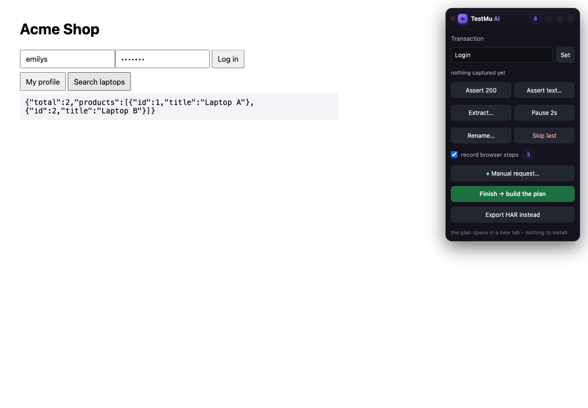
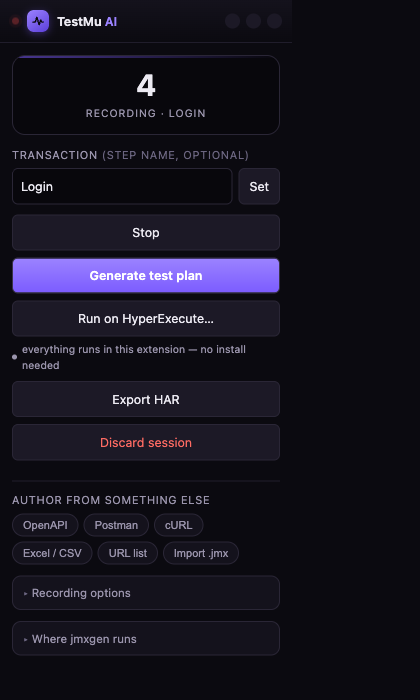

# Recording a journey

This is the path BlazeMeter's Chrome recorder covers, and the one people ask for
first: don't make me write a test, let me click through the app and get one.

You record in your own Chrome, with your profile, your SSO session, your VPN and
your feature flags. Nothing is proxied, nothing is uploaded, and the plan is
built in the browser.

## Recording

Open the popup with the toolbar icon, or `⌘⇧9` / `Ctrl+Shift+9`.


There are two ways to start, and the difference matters. **Start recording this
tab** attaches to the page in front of you, which is right when you are already
where you want to begin. Typing a URL in the box and pressing **Go** opens it in
a new tab and attaches before anything is sent, so you capture request number
one: the first navigation, the redirect chain, the SSO bounce. Those are exactly
the requests a plan needs and the ones an already-open tab has missed.

Chrome then shows a banner saying the extension started debugging this browser.
That is the DevTools protocol attaching, and it is the only Chrome API that can
read response bodies, which correlation cannot work without.

Now browse. Log in, click, submit, search. A panel appears on the page:



When you are done, press **Finish → build the plan**. The plan opens in a new
tab, already generated.



## Annotating as you browse

A raw recording cannot know what a step means. The panel is where you say so, at
the moment you are looking at the thing, rather than an hour later in a JMeter
tree.

| Control | What it writes into the plan |
|---|---|
| Transaction | every request from here on lands in this Transaction Controller, which is what turns 200 requests into Login, Search and Checkout in the report |
| Assert 200 | a response assertion on the last request |
| Assert text… | "body contains …" on the last request, the check that catches a 200 carrying an error page |
| Extract… | a JSON extractor: `$.data.token` becomes `${TOKEN}` |
| Pause 2s | a Flow Control Action pause after that request |
| Rename… | the sampler label |
| Skip last | drops that request from the plan |
| + Manual request… | a request you type in, one that never happened but has to be in the test |

Drag the panel by its title bar. The `–` button hides it, and it comes back on
the next captured request or from the popup.

Everything you add travels inside the exported HAR as `_jmxgen` fields, a custom
key the HAR spec permits, so the file stays a valid HAR that DevTools and other
tools still read.

```json
{
  "pageref": "Login",
  "request":  { "method": "POST", "url": "https://shop.test/api/login" },
  "response": { "status": 200, "content": { "text": "{\"data\":{\"token\":\"…\"}}" } },
  "_jmxgen": {
    "name": "Login call",
    "assert": [{ "field": "body", "match": "contains", "pattern": "token" }],
    "extract": [{ "type": "json", "var": "TOKEN", "query": "$.data.token" }],
    "pause_after_ms": 2000
  }
}
```

## Two artifacts from one session

The *record browser steps* checkbox in the panel is on by default, and its
counter climbs as you click. So one session gives you two things.

The protocol plan, a `.jmx` of HTTP samplers with no browser involved, is what
scales to thousands of users on a handful of machines. The browser test is the
same journey as real clicks and typing, and it is what proves the journey still
works when the front end changes.

Both are on the result page: **Download .jmx** and **Download browser test .py**.
The browser test is Playwright, and it uses ranked locators rather than recorded
XPaths:

```
data-testid  →  id (unless it looks generated)  →  name  →  aria-label
             →  link text  →  placeholder  →  scoped CSS  →  xpath
```

Each candidate is re-queried against the live DOM at capture time, and the first
that resolves uniquely is the one written down. A recorder that emits
`/html/body/div[3]/div[2]/form/button` produces a script that breaks on the next
release. This is the difference between a recording you keep and one you redo
every sprint.

Browser steps can also go into the `.jmx` itself, as WebDriver samplers, which
need `jmeter-plugins-webdriver` on the runner. The log says so by name at
generation time.

## Recording options

These sit under *Recording options* in the popup and apply live, so changing one
mid-session pushes it to the attached tab. You never have to throw away a
recording to fix a setting.

| Option | What it does |
|---|---|
| Device | iPhone 14, Pixel 7, iPad Pro, Galaxy S22 or desktop. Sets the metrics and the user agent together, so you capture the mobile site |
| User agent | override it by hand |
| Blocked patterns | drop hosts at capture time: analytics, chat widgets, anything you will never load-test |
| Disable cache | every asset is fetched, so the recording reflects a cold visit |
| Bypass service worker | requests hit the network instead of being answered from a worker cache |

`⌘⇧8` / `Ctrl+Shift+8` starts and stops recording without opening the popup.

[OPTIONS.md](OPTIONS.md) works through each of these with an example, along with
every other control in the extension.

## Recording for an hour

There is no limit on how long you record, and nothing is sampled or dropped
along the way. What makes that work is being selective about *bytes* rather
than about requests.

Every request is stored. For service calls and pages that means the method,
URL, headers, body, status and response text: everything the plan is built
from. For images, fonts, stylesheets and scripts it means a stub, because their
content cannot appear in a `.jmx` — a font's bytes cannot be asserted on,
correlated, or sent by a sampler. Their URL, method and type are kept, which is
all a `web` plan ever needs, so one recording still authors either kind of plan
without keeping a megabyte of CSS.

Measured on a real session of 241 requests, 200 of them images: 241 entries and
41 bodies on disk. The images cost nothing but their addresses.

The recording is written to IndexedDB as it happens, which means:

- it is on disk, not in memory, so an hour-long session costs the browser
  nothing to hold;
- it survives Chrome evicting the extension's worker, which happens routinely
  during quiet stretches;
- it survives closing Chrome altogether, and is offered back when you return.

A realistic hour on an API-heavy application is roughly 3,000 service calls and
70 MB. The browser grants gigabytes, and the popup shows the headroom.

## What gets thrown away

A raw browser session is mostly not a load test. From the sample recording:

```
kept 3 of 58 recorded requests across 1 page(s)
  (dropped 42 static, 13 third-party, 0 filtered)
```

Static assets go first: images, fonts, CSS. A CDN serving a logo 500 times tells
you nothing about your API, and it drags the average response time down until the
report is flattering and useless. Third-party requests follow: analytics, tag
managers, chat. Load-testing someone else's service is noise at best. Anything
you excluded yourself is counted as filtered.

*Keep: web* keeps the assets, for when the page load is the thing you are
measuring. It is the same recording either way, because the decision is made at
generation time rather than at record time, so you are never forced to record
again.

## Correlation

Every recorded response is scanned for values that turn up in a later request:
bearer tokens, CSRF tokens, session ids, order ids. When one matches, the plan
gets an extractor on the first response and a `${VARIABLE}` in the second, and
the Correlations tab shows the rule that matched, the confidence, and the exact
hop.

```
${ACCESSTOKEN}   bearer-token   high   from body
                 POST /auth/login -> GET /auth/me
```

This is what separates a recording from a test. Replay a recording as it stands
and it fails the moment the token expires, which is to say almost immediately.

## Recording without the extension

For the cases a Chrome extension cannot reach, the same recorder exists in the
[jmxgen CLI](https://github.com/RishabhLambdaTest/jmxgen), a separate repository
needed only for these:

```bash
jmxgen record https://app.example.com -o plan.jmx   # Playwright drives a browser
jmxgen capture --port 8080 -o plan.jmx              # a proxy: mobile apps, Postman,
                                                    # desktop clients, backend traffic
```

Firefox is not supported, and not for want of effort. It does not implement
`chrome.debugger`, so response bodies cannot be captured, so correlation has
nothing to work with. Use `jmxgen record` there.
