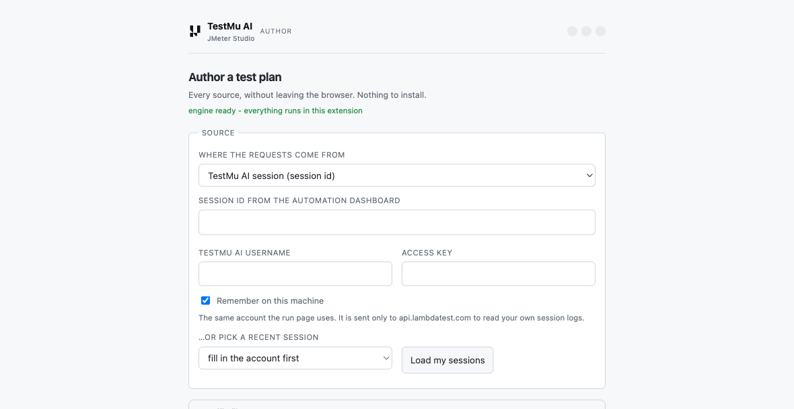
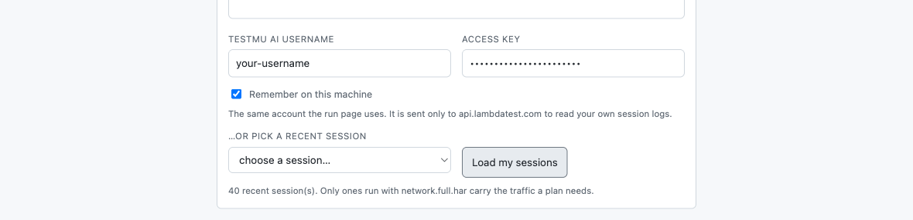
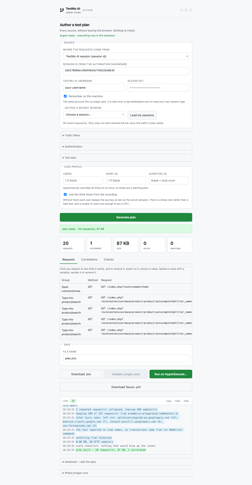
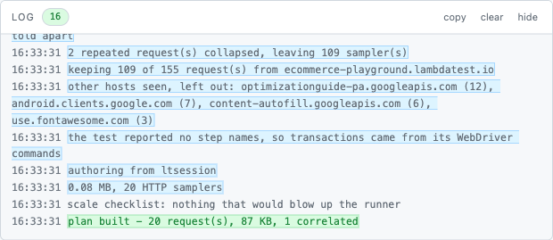
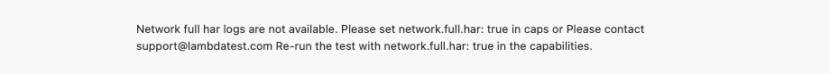

# Author from a TestMu AI session

An automation session that already ran with network logging captured everything
a load test needs. This turns one into a JMeter plan, grouped into the steps the
test itself performed.

No recording, no proxy, no re-running anything. If the session exists, the plan
exists.

---

## What you need

One capability on the run that produced the session:

```
"network.full.har": true
```

That is the whole prerequisite, and it is worth saying plainly to a customer:
**switch it on and every automation session becomes a load test for free.**

Sessions without it are refused with the exact capability to set, because a plan
built from the alternatives would be silently wrong. See
[Why full HAR](#why-full-har-and-not-the-other-logs) below.

Selenium only. Playwright sessions do not produce a full HAR today.

---

## Doing it

Open the authoring page and choose **TestMu AI session (session id)**.



The account is the same one the run page uses, so if you have already filled it
in there, it is here too. It is sent only to `api.lambdatest.com`, to read your
own session logs.

You can paste a session id, or press **Load my sessions** and choose one.



Then **Generate plan**. That is the whole flow.



---

## What you get

Transactions named after the steps the test took, not the requests it made:

| Transaction | What it holds |
| --- | --- |
| `Open common/home` | the home page and everything it pulled in |
| `Type into product/search` | the typeahead calls and the search itself |
| `Open product/product` | the product page and its review call |
| `Click checkout/cart/add` | the POST, and the basket refresh it triggered |
| `Open checkout/cart` | the basket |
| `Click account/login` | the login POST |

This is the shape both JMeter's own recorder and BlazeMeter produce: a
transaction controller per user action, named after the action. It is what makes
a HyperExecute report readable, because *"Add to cart is slow at 500 users"* is a
sentence somebody can act on.

Where the test named its own steps, those names are used instead. A run that
reports `Click 'Search' button at bottom` keeps exactly that.

### How the grouping is decided

Three sources, best first:

1. **The step names the test reported.** Annotated runs carry them.
2. **The WebDriver commands.** Every plain Selenium run has these, so a
   navigation becomes `Open`, a click becomes `Click`, typing becomes
   `Type into`, and the target comes from the request the step caused.
3. **Page navigations**, if the command log is empty.

The log always says which one was used, and why a plan came out the way it did.



---

## What it leaves out

**Third-party traffic.** One real session's busiest hosts were `youtube.com` and
two CDN nodes; the application was 85 requests out of 4,081. Converting that
unfiltered would not merely bloat the plan, it would point a thousand-user run at
other people's production services. The busiest first-party host is picked
automatically and the rest are named in the log.

**Loopback addresses.** `127.0.0.1` and private ranges are never the system under
test, and a run from a cloud machine could not reach them anyway.

**Repeated calls.** The same request twice inside one transaction becomes one
sampler.

**What it keeps, deliberately:** typing `iPhone` into a search box sends one
request per keystroke, and all of them are kept. They are real traffic, and
JMeter offers the same trim as an option rather than a default. The log points
them out and you can delete rows in the editor. Keep one unless the autocomplete
is what you are testing.

---

## When a plan has one transaction

Usually because the session only did one thing. The log distinguishes the cases
rather than leaving you guessing:

- **Fewer requests than steps.** A session with one application request cannot be
  split across three steps, so the steps collapse into one.
- **All the traffic in one step.** A test that sits on a page for 400 seconds
  puts everything in that step, legitimately.
- **Timelines that do not meet.** Only this one means the clocks disagree, and
  only then is the grouping untrustworthy.

---

## Why full HAR and not the other logs

Three endpoints can return a session's traffic, and only one is usable:

| Log | Available on | Carries bodies | Usable for load |
| --- | --- | --- | --- |
| `full-har` | most sessions | **yes** | **yes** |
| `network.har` | rarely | no | no |
| `network` | most | no | no |

Measured across 60 sessions: `full-har` on 53, `network.har` on 2.

The other two return entries with `bodySize: 86` and no `postData`, and
`content.size: 0` with no `text`. A plan built from them would POST **nothing**
and could not correlate a single token, because there is no response text to find
one in. It would look fine, validate fine, and be wrong against the real
application. So it is refused instead:



---

## Size

Sessions vary enormously. The largest measured was **70 MB compressed, 324 MB
across 47 files**, and it converts in about twenty seconds — nearly all of that
the download.

The archive is read one member at a time and filtered on the way in, so the tab
holds one piece rather than the whole thing. The size is known before anything is
downloaded, so a large session says so instead of appearing to hang.

---

## Limits worth knowing

- **Selenium only.** Playwright sessions return no full HAR.
- **A session is one plan.** Combining several into one journey is not supported.
- **The API returns 500 sometimes** — about one call in ten in a 40-session
  sample. Requests retry, and a failure is reported rather than producing a
  partial plan.
- **Secrets ride along.** A recorded session carries whatever headers it sent,
  including `Authorization`. Review the plan before uploading it anywhere, and
  use *Replace value* in the [editor](EDITING.md) to turn a token into a
  variable.

---

## Related

- [Sources](SOURCES.md) — the other seven ways in
- [Transactions](TRANSACTIONS.md) — what transactions mean in JMeter, and how to
  name them while recording
- [Editing](EDITING.md) — renaming, reordering and parameterising a generated plan
