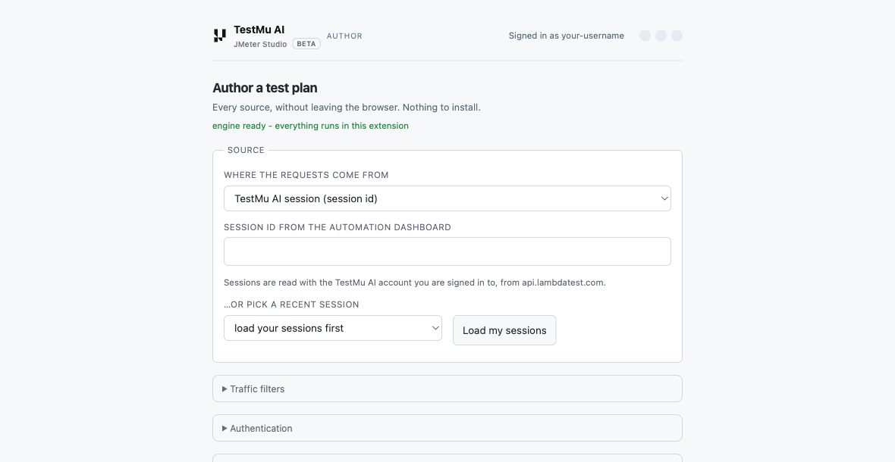
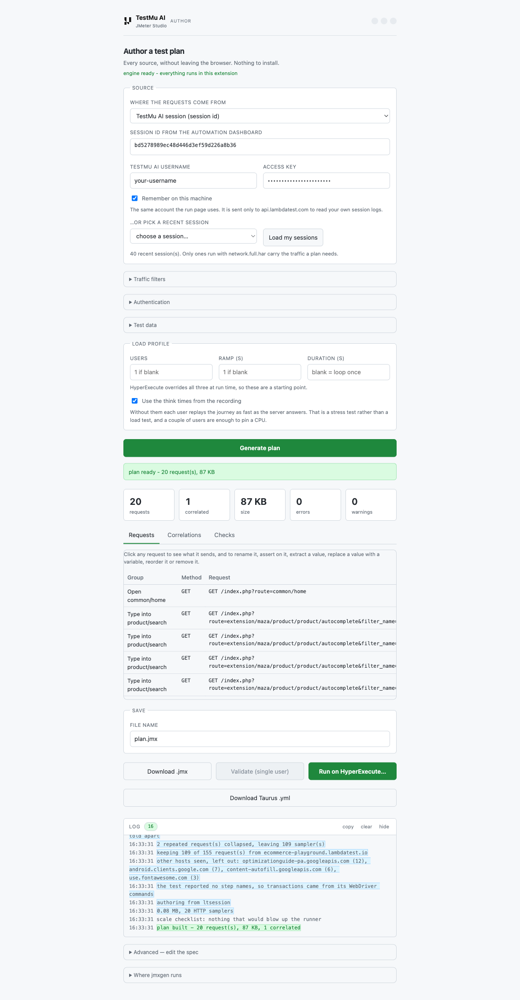
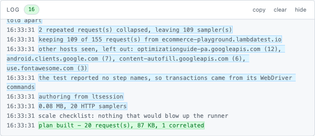

# Author from a TestMu AI session

An automation session that already ran with network logging captured everything
a load test needs. This turns one into a JMeter plan, grouped into the steps the
test itself performed.

No recording, no proxy, no re-running anything. If the session exists, the plan
exists.

---

## What you need

One capability on the run that produced the session:

```
"network.full.har": true
```

That is the whole prerequisite, and it is worth saying plainly to a customer:
**switch it on and every automation session becomes a load test for free.**

Sessions without it fall back to `network.har`, which gives the requests but not
their bodies, so the plan that comes back cannot log in or submit anything. The
page says so as loudly as an error, and names the capability to set. See
[Why full HAR](#why-full-har-and-not-the-other-logs) below.

Selenium only. Playwright sessions do not produce a full HAR today.

---

## Doing it

Open the authoring page and choose **TestMu AI session (session id)**.



Sessions are read with the TestMu AI account you signed in with, from
`api.lambdatest.com`. There is no account to fill in.

You can paste a session id, or press **Load my sessions** and choose one.


Then **Generate plan**. That is the whole flow.



---

## What you get

Transactions named after the steps the test took, not the requests it made:

| Transaction | What it holds |
| --- | --- |
| `Open common/home` | the home page and everything it pulled in |
| `Type into product/search` | the typeahead calls and the search itself |
| `Open product/product` | the product page and its review call |
| `Click checkout/cart/add` | the POST, and the basket refresh it triggered |
| `Open checkout/cart` | the basket |
| `Click account/login` | the login POST |

This is the shape both JMeter's own recorder and BlazeMeter produce: a
transaction controller per user action, named after the action. It is what makes
a HyperExecute report readable, because *"Add to cart is slow at 500 users"* is a
sentence somebody can act on.

Where the test named its own steps, those names are used instead. A run that
reports `Click 'Search' button at bottom` keeps exactly that.

### How the grouping is decided

Three sources, best first:

1. **The step names the test reported.** Annotated runs carry them.
2. **The WebDriver commands.** Every plain Selenium run has these, so a
   navigation becomes `Open`, a click becomes `Click`, typing becomes
   `Type into`, and the target comes from the request the step caused.
3. **Page navigations**, if the command log is empty.

The log always says which one was used, and why a plan came out the way it did.



---

## What it leaves out

**Third-party traffic.** One real session's busiest hosts were `youtube.com` and
two CDN nodes; the application was 85 requests out of 4,081. Converting that
unfiltered would not merely bloat the plan, it would point a thousand-user run at
other people's production services. The busiest first-party host is picked
automatically and the rest are named in the log.

**Loopback addresses.** `127.0.0.1` and private ranges are never the system under
test, and a run from a cloud machine could not reach them anyway.

**Repeated calls.** The same request twice inside one transaction becomes one
sampler.

**What it keeps, deliberately:** typing `iPhone` into a search box sends one
request per keystroke, and all of them are kept. They are real traffic, and
JMeter offers the same trim as an option rather than a default. The log points
them out and you can delete rows in the editor. Keep one unless the autocomplete
is what you are testing.

---

## When a plan has one transaction

Usually because the session only did one thing. The log distinguishes the cases
rather than leaving you guessing:

- **Fewer requests than steps.** A session with one application request cannot be
  split across three steps, so the steps collapse into one.
- **All the traffic in one step.** A test that sits on a page for 400 seconds
  puts everything in that step, legitimately.
- **Timelines that do not meet.** Only this one means the clocks disagree, and
  only then is the grouping untrustworthy.

---

## Why full HAR and not the other logs

Three endpoints can return a session's traffic, and only one is usable:

| Log | Available on | Carries bodies | Usable for load |
| --- | --- | --- | --- |
| `full-har` | most sessions | **yes** | **yes** |
| `network.har` | rarely | no | as a fallback: the requests, sent without bodies |
| `network` | most | no | no |

Measured across 60 sessions: `full-har` on 53, `network.har` on 2.

The other two return entries with `bodySize: 86` and no `postData`, and
`content.size: 0` with no `text`. A plan built from them POSTs **nothing** and
cannot correlate a single token, because there is no response text to find one
in. It looks fine and is wrong against the real application.

So `full-har` is always tried first. Only when a session has none is
`network.har` read, and the plan built from it is reported as an error-level
message: the requests are right, the bodies are missing, and re-running with
`"network.full.har": true` is the fix. A session with neither is refused.

---

## Size

Sessions vary enormously, and size is no longer a reason one is refused.

The captures are **read as they inflate**, one entry at a time, and a response
body longer than 256 KB is shortened *while it goes past* rather than after.
What never exists is the whole capture as a string, or the object graph built
from it.

That last part matters more than the entry count. Measured on a real session:
**147.9 MB across 55 entries — one of which was a single 123 MB response body**
from `optimizationguide-pa.googleapis.com`, which is Chrome's own model
downloader and never part of the plan. Reading "one entry at a time" would
still have held that entry whole.

| | |
|---|---|
| Capture | 147.9 MB, 55 entries |
| Bodies shortened | 13, leaving out 99 MB |
| Retained | 1.5 MB |
| Tab heap while converting | 95 MB |
| Time, download included | 12.8 s |

**What a shortened body costs you.** Correlation reads the start of a response,
so in practice nothing: a token near the top of a page is found as usual. A
value beyond 256 KB into a body cannot be found, and the log says how many
bodies were shortened and how much was left out, so it is never silent.

The limits that remain are the ones that still bite:

| Limit | Value | Why |
|---|---|---|
| `full-har` archive, as downloaded | 400 MB | the download itself has to finish |
| any one response body | 256 KB kept | past that a body is shortened, not the session refused |
| `network.har` | 200 MB | it arrives as one JSON document and is parsed whole |
| requests in the plan | 20,000 | past that the plan is not one anyone would run |

The request count is the real guard: what exhausts a tab is thousands of
samplers, not a big file. Hitting it stops the conversion, and the log lists
the hosts so you can pick a smaller one.

---

## Limits worth knowing

- **Selenium only.** Playwright sessions return no full HAR.
- **A session is one plan.** Combining several into one journey is not supported.
- **The API returns 500 sometimes** — about one call in ten in a 40-session
  sample. Requests retry, and a failure is reported rather than producing a
  partial plan.
- **Secrets ride along.** A recorded session carries whatever headers it sent,
  including `Authorization`. Review the plan before uploading it anywhere, and
  use *Replace value* in the [editor](EDITING.md) to turn a token into a
  variable.

---

## Related

- [Sources](SOURCES.md) — the other seven ways in
- [Transactions](TRANSACTIONS.md) — what transactions mean in JMeter, and how to
  name them while recording
- [Editing](EDITING.md) — renaming, reordering and parameterising a generated plan
