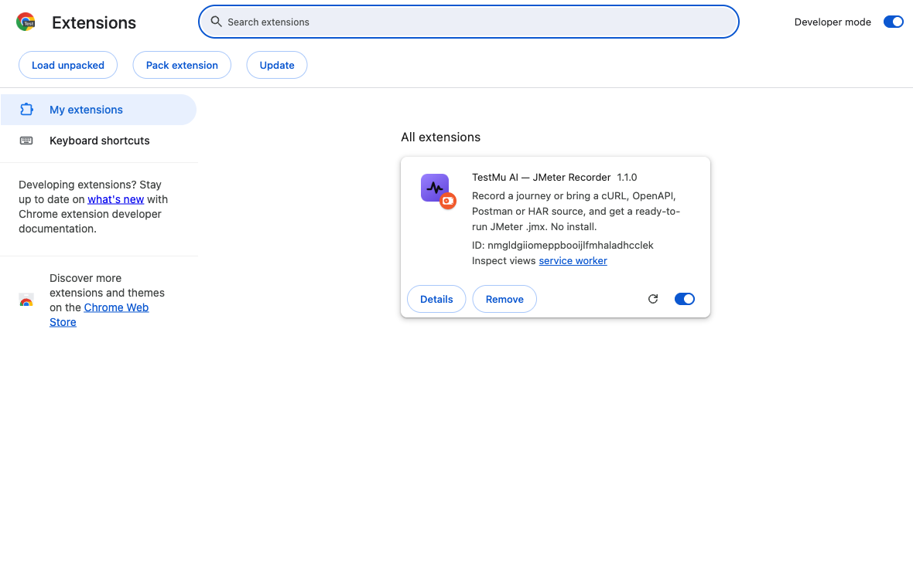
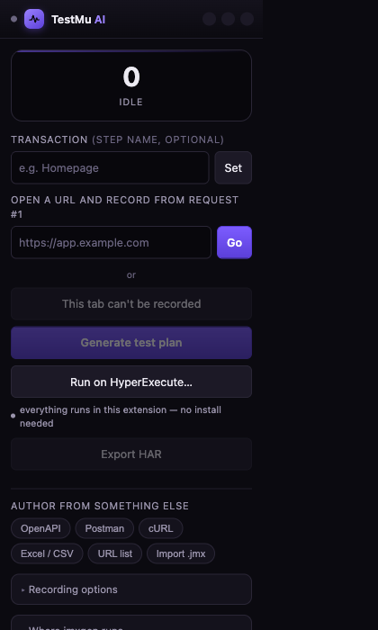
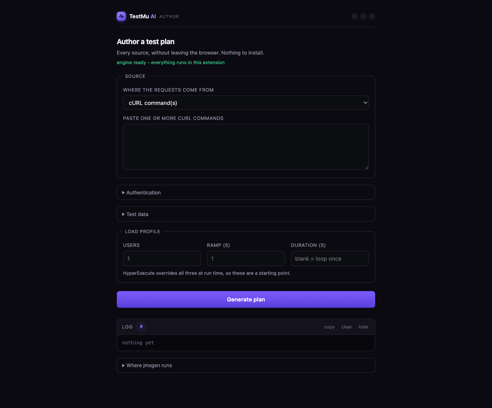
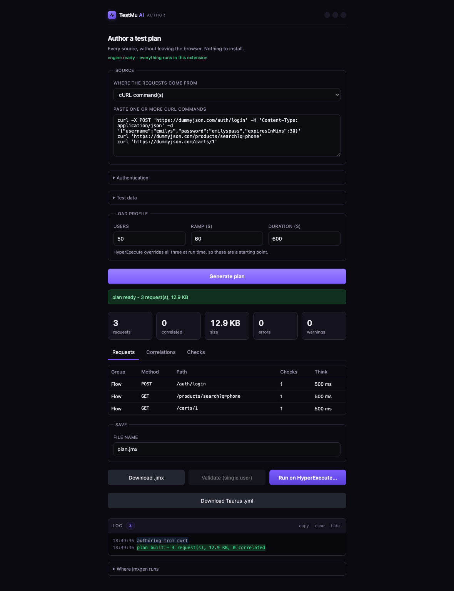
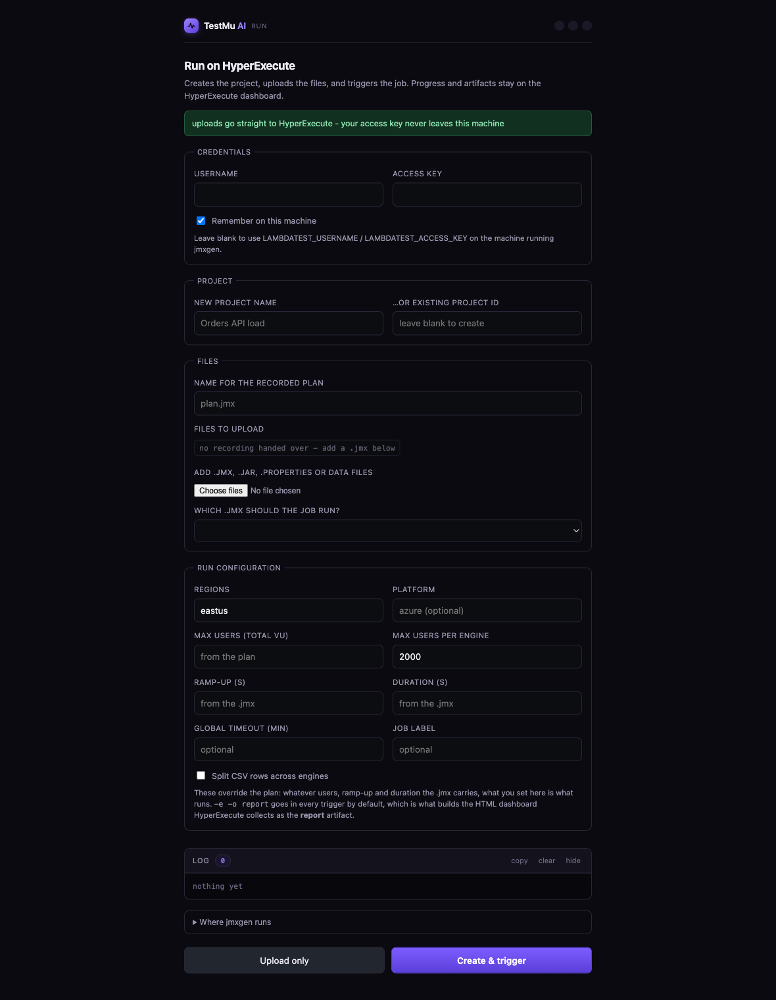

# Setup — from a zip to a running load test

Everything in this guide happens inside Chrome. There is no CLI to install, no
Python, no JMeter, no local server. The plan is built by an engine that ships
inside the extension and runs in WebAssembly, and the run is triggered straight
against the HyperExecute API.

Time from receiving the zip to a job on the dashboard: about five minutes.

---

## What you send someone

One file:

```
dist/testmu-recorder-1.1.0-share.zip     ~6 MB
```

Build it with `jmxgen-recorder/package.sh`. It produces two zips because they are
not the same shape:

| File | For |
|---|---|
| `testmu-recorder-<v>-share.zip` | **people** — unzips to a `testmu-recorder/` folder, ready for *Load unpacked* |
| `testmu-recorder-<v>.zip` | **the Chrome Web Store** — files at the root, which is what the store requires |

Send the `-share` one. Someone who unzips the store build gets 20 loose files in
their Downloads folder.

---

## Step 1 — unzip it

Unzip anywhere you will not delete it. Chrome does not copy an unpacked
extension; it loads it from wherever it sits, so moving the folder later
disables it.

```
~/Downloads/testmu-recorder/
```

## Step 2 — open the extensions page

Go to `chrome://extensions` (Chrome, Edge, Brave, Arc — anything Chromium).

## Step 3 — turn on Developer mode

The toggle is at the top right. Three buttons appear on the left.



## Step 4 — Load unpacked → pick the folder

Select the `testmu-recorder` folder itself — the one **containing**
`manifest.json`, not the zip and not its parent.

> **"Manifest file is missing or unreadable"** means the folder you picked has no
> `manifest.json` directly inside it. You picked the parent, or the zip is still
> zipped. Open the folder you selected: you should see `manifest.json`,
> `background.js`, `popup.html`.

## Step 5 — pin it

Click the puzzle-piece icon in the toolbar, then the pin next to
**TestMu AI — JMeter Recorder**. The violet mark appears in the toolbar.

---

## Your first plan, without recording anything

Click the toolbar icon. This is the popup:



Under **Author from something else**, click **cURL**. The authoring page opens:



Paste a couple of curl commands — copy any request out of DevTools with
*Right-click → Copy → Copy as cURL* — set **Users**, **Ramp** and **Duration**,
then press **Generate plan**:



You now have a `.jmx`. **Download .jmx** saves it; **Run on HyperExecute…** takes
it straight to a job.

Everything the engine did is in the **Log** panel at the bottom — including any
warning about a plugin the runner will need. Nothing is written to a terminal,
because there is no terminal.

---

## Running it on HyperExecute

**Run on HyperExecute…** opens the run page with the plan already attached:



Fill in:

| Field | Where it comes from |
|---|---|
| **Username** | `accounts.lambdatest.com/detail/profile` — the *username*, not the email you sign in with |
| **Access key** | the same page |
| **New project name** | anything; or paste an existing **Project ID** to add a run to a project you already have |
| **Regions** | `eastus` is the default; comma-separate for a multi-region run |
| **Max users (total VU)** and **Max users per engine** | together these decide how many machines the job spreads across |
| **Ramp-up / Duration** | these **override** whatever the `.jmx` says |

Press **Create & trigger**. The log prints the project ID, each uploaded file and
the job ID, and the dashboard opens.

**Credentials never leave the machine.** The extension calls the HyperExecute API
directly from your browser; there is no server in the middle. "Remember on this
machine" stores them in Chrome's extension storage, on that profile only.

### If it fails

Every failure names the actual cause. The one that catches everyone:

```
HyperExecute rejected the credentials (HTTP 401).
Username must be the LambdaTest username, not the email you sign in with.
Both are on accounts.lambdatest.com/detail/profile.
```

HyperExecute answers *every* credential problem with the same
`1002 - Invalid Authentication Token`, so the message has to supply the part the
API withholds.

---

## Rolling it out to a team

**Ad-hoc (a few people).** Send the `-share` zip and this page. That is the whole
process.

**Managed Chrome (policy blocks unpacked extensions).** Force-install it instead —
no Developer mode, no zip:

```json
{
  "ExtensionSettings": {
    "<EXTENSION_ID>": {
      "installation_mode": "force_installed",
      "update_url": "https://clients2.google.com/service/update2/crx"
    }
  }
}
```

**Chrome Web Store, unlisted.** Upload `testmu-recorder-<v>.zip`, set visibility
to **Unlisted**, and share the link. Everyone then gets updates automatically.
Listing copy, the permission justifications a reviewer will ask for, and the
data-use disclosure are in
[`jmxgen-recorder/STORE_LISTING.md`](../jmxgen-recorder/STORE_LISTING.md).

---

## What the permissions are for

A reviewer — and a security team — will ask. Short answers:

| Permission | Why it is needed |
|---|---|
| `debugger` | The DevTools protocol is the only Chrome API that exposes **response bodies**, and correlation cannot work without them. `webRequest` cannot read them. This is also why Chrome shows a "started debugging this browser" banner while recording. |
| `tabs` | To attach to the tab you chose, and to follow SSO popups it opens. |
| `storage` | Checkpoints an in-progress recording, so an evicted service worker does not lose it. |
| `downloads` | Saving the `.jmx`, the HAR, the Taurus YAML you asked for. |
| `offscreen` | A service worker cannot create blob URLs; the offscreen document builds the file to download. |
| `<all_urls>` | You choose the site to record; the extension cannot know it in advance. Capture only ever runs on a tab you explicitly started. |

No analytics, no telemetry, no third-party endpoints. The only network calls the
extension makes are to the target you are testing and, if you use it, to the
HyperExecute API with your own credentials.

---

## Optional: the local console

Nothing above needs it. One feature does: **Validate (single user)** runs the
plan once against the real target and reports per-request status codes and any
`${VARIABLE}` that never resolved — and that needs a real JMeter binary, which a
browser cannot provide.

If you want it:

```bash
./dist/jmxgen-macos/jmxgen console
```

The popup then says *"local console found — single-user Validate is available
too"* instead of *"everything runs in this extension"*. That is the only
difference.
