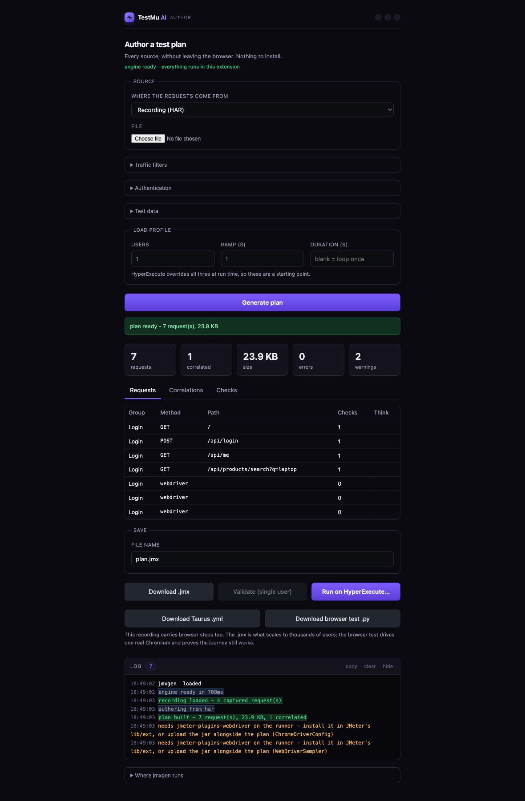

# Sources

Seven inputs produce the same thing: a valid JMeter `.jmx` with assertions,
extractors, a load profile and correlated tokens. Pick whichever matches what
your team already has. You never need more than one.

Every sample named below sits in [`sample/`](../sample/) and points at
[dummyjson.com](https://dummyjson.com), a public API that needs no key, so a new
user can try all seven on the day they install the extension.

In the extension, open the popup and choose a source under *Author from something
else*, or use the **Source** dropdown on the authoring page. That is all you need.


Each source below also names its command-line equivalent. Those belong to the
[jmxgen CLI](https://github.com/RishabhLambdaTest/jmxgen), a separate repository
for CI use. They are listed so the two stay recognisably the same tool, not
because anything here requires them.

## How the flow runs

```
  a source you already have
          ↓
  Generate plan          the engine runs inside the extension, in WebAssembly
          ↓
  Requests · Correlations · Checks       what it decided, and why
          ↓
  Download .jmx   or   Run on HyperExecute…
```

Every result leads with three numbers: requests, correlated, errors. A plan with
errors is never shipped quietly.

---

## 1. cURL

The fastest route to a first plan.

Paste the contents of `sample/requests.txt` into the text box, or run
`jmxgen from-curl sample/requests.txt -o plan.jmx`. Either way: three requests.

In DevTools, right-click any request and choose *Copy → Copy as cURL*, then
paste. `-X`, `-H`, `-d`, `-F` and `-u` are all handled, and a POST body is sent
raw rather than URL-encoded. That last detail is what usually turns a request
that worked in a terminal into a 400 once JMeter sends it.


## 2. OpenAPI and Swagger

For when there is a contract.

Upload `sample/api.yaml`, or paste a live spec URL such as
`https://petstore3.swagger.io/api/v3/openapi.json`. On the CLI,
`jmxgen from-openapi sample/api.yaml -o plan.jmx` gives three operations.

Path parameters survive as parameters. `/products/{id}` is emitted as `${id}`
rather than frozen at whatever value the example showed, so a CSV of ids can
drive it later. The live Petstore URL yields 19 requests with no file at all.

## 3. Postman collections

For when the team already maintains one.

Upload `sample/collection.json`, or run
`jmxgen from-postman sample/collection.json -o plan.jmx`. Three requests.

Folders become Transaction Controllers, and Postman's own chaining survives the
crossing. A `pm.environment.set("token", ...)` becomes a JMeter JSON extractor,
so the next request's `{{token}}` works as `${token}`. That conversion is the
part teams otherwise redo by hand over a day or two.

## 4. Recordings

Upload `sample/recording.har` with *Keep: api*, or run
`jmxgen from-har sample/recording.har --mode api -o plan.jmx`.

The sample is a real browser session: log in, call a protected endpoint, search
products. Fifty-eight requests, including images, fonts and Google Tag Manager.
What comes out of it:

```
kept 3 of 58 recorded requests across 1 page(s)
  (dropped 42 static, 13 third-party, 0 filtered)
  correlated 1 value(s):
    ${ACCESSTOKEN}   bearer-token   high   from body
                     POST /auth/login -> GET /auth/me
```

Two things happened there. Forty-two assets and thirteen tracker requests went
away, all of which would have dragged the average response time down until the
report flattered the system and told you nothing. And the login token was found
in one response and wired into the next, reported with the rule that matched it,
a confidence, and where it flows from and to.

Replay that recording as it stands and it fails, because the token has expired.
That is the problem correlation solves, and it is the largest single reason
hand-built JMeter plans come back full of 401s.

Switching to *Keep: web* keeps the assets your own domain served: 26 of the 58,
because third-party hosts are still refused. One recording, either an API-level
or a browser-level plan, decided at generation time rather than at record time.

Cross-origin APIs also arrive with a CORS preflight in front of every call.
Those are dropped: the browser sends `OPTIONS` because its security model
demands it, JMeter never does, and a preflight sampler would double the request
count of a plan while measuring nothing real.

This is the only source where correlation has anything to work with, since it is
the only one carrying real responses. Which is why the recorder exists;
[RECORDING.md](RECORDING.md) covers it.



## 5. Excel and CSV sheets

For when the endpoint list belongs to someone who does not write code.

Upload `sample/endpoints.xlsx`, or run
`jmxgen from-excel sample/endpoints.xlsx -o plan.jmx`. Three samplers.

The `assert` and `extract` columns become real assertions and extractors, so a
product owner can fill in a sheet and a load test comes out of it.
`jmxgen template mine.xlsx` writes the empty sheet to hand them.

## 6. Page URL lists

For when there is nothing at all.

Paste the contents of `sample/urls.txt`, one URL per line, or run
`jmxgen probe sample/urls.txt -o plan.jmx`. One URL becomes 19 samplers.

It fetches the page and reads the HTML for scripts, stylesheets, images and
forms, then drops third-party and tracker hosts. No spec, no recording, no time:
this is the escape hatch.

## 7. Existing plans

For when you have inherited one.

Upload `sample/existing-plan.jmx`, or run
`jmxgen import-jmx sample/existing-plan.jmx --spec plan.yaml -o clean.jmx`.

The plan comes back as an editable spec, so you can see what is in it, filter it,
and re-emit it clean. Anything jmxgen does not model is preserved as it was
rather than dropped. For plans that are bloated or broken, `jmxgen optimize` is
the companion.

---

## Supporting files

| File | Used with | What it shows |
|---|---|---|
| `sample/users.csv` | Test data in the authoring page, or `--csv` | 50 virtual users who are not all `emilys` |
| `sample/workload.yaml` | `jmxgen build` | closed against arrival-rate thread groups |
| `sample/mtls.yaml` | `jmxgen build` | client certificates, and the `system.properties` that goes with them |

### Open and closed workloads

An ordinary JMeter Thread Group is a closed model: 500 users, each waiting for
its own response before sending the next. When the system slows down, the load
drops, which is the opposite of what an incident looks like.
`sample/workload.yaml` shows the other model:

```yaml
thread_groups:
  - name: Steady arrivals
    model: arrivals        # jpgc casutg ArrivalsThreadGroup
    rate: 120              # 120 new users a minute, whatever the response time
    ramp_up: 60
    hold: 900
```

Arrivals keep arriving while the service degrades, which is how you find the
knee. This needs `jmeter-plugins-casutg` on the runner. `verify` names the jar,
and on HyperExecute you upload it alongside the plan.

### Authentication that survives 500 users

A login that runs once per user, with credentials from a CSV:

```bash
jmxgen from-curl sample/requests.txt -o plan.jmx \
  --login "POST /auth/login" \
  --login-body '{"username":"${username}","password":"${password}"}' \
  --login-token '$.accessToken' \
  --csv sample/users.csv:username,password
```

The login becomes a setUp Thread Group, and the token is published with
`props.put("AUTH_TOKEN", ...)` then read back as `Bearer ${__P(AUTH_TOKEN)}`.
That is a JMeter property, not a variable. Variables are per-thread, so a token
extracted by user 1 is invisible to users 2 through 500. Getting this backwards
is the usual reason a plan behaves perfectly with one user and returns a wall of
401s under load.

In the extension the same settings live under *Authentication* and *Test data*.

---

## Once the plan exists

| Action | What it does | What it needs |
|---|---|---|
| Download .jmx | the plan itself | nothing |
| Run on HyperExecute… | project, upload, trigger, dashboard | LambdaTest credentials |
| Download Taurus .yml | the same test as a `bzt` config | `bzt`, if you use it |
| Download browser test .py | a Playwright script for the browser steps | Playwright, if you run it |
| Validate (single user) | runs it once, reporting codes and unresolved variables | the local console and JMeter |

Validate is the cheap gate. Finding a broken extractor at one user costs seconds.
Finding it at 500 costs a run.
