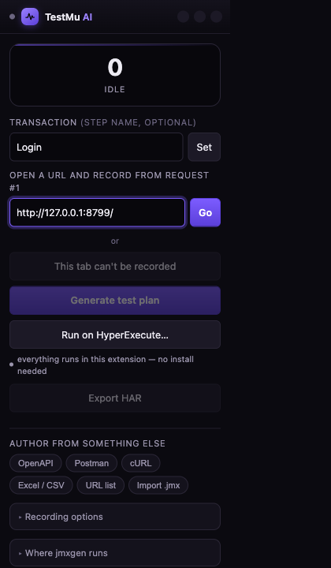
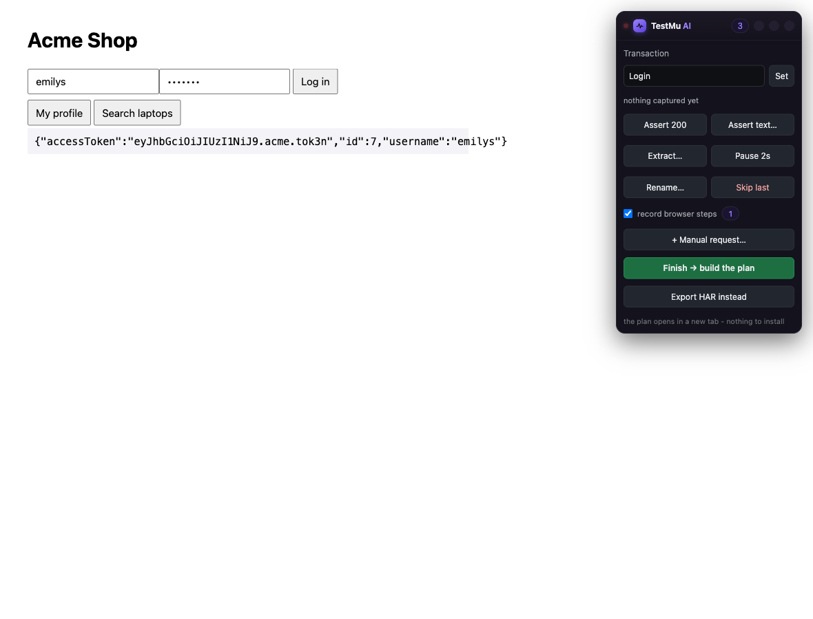
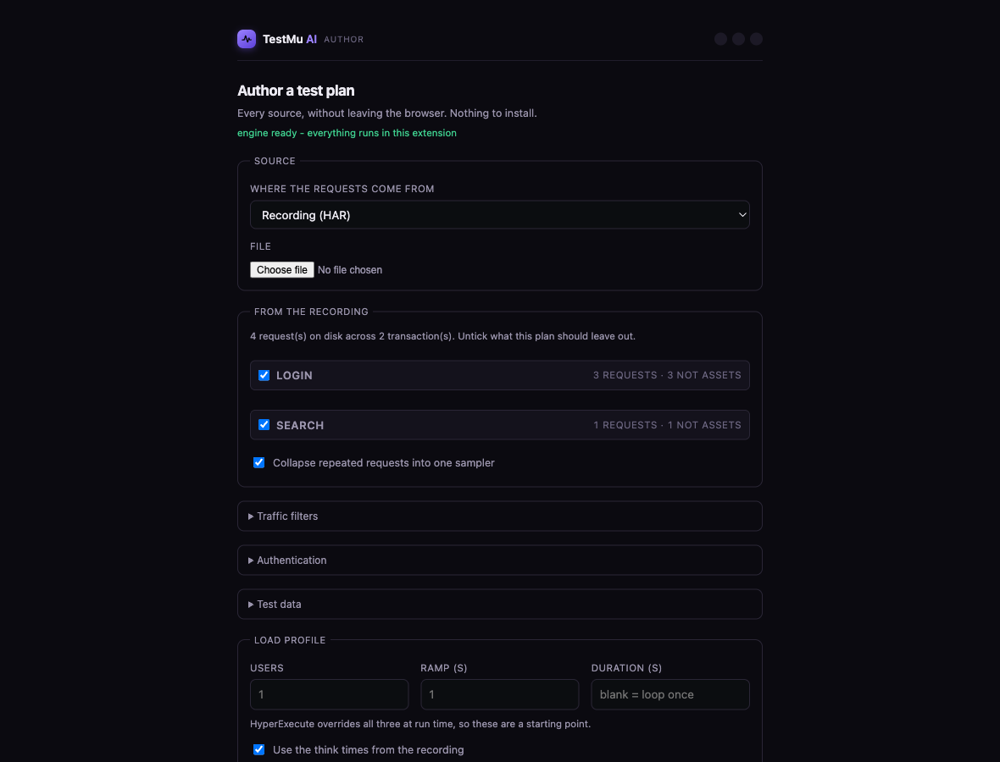
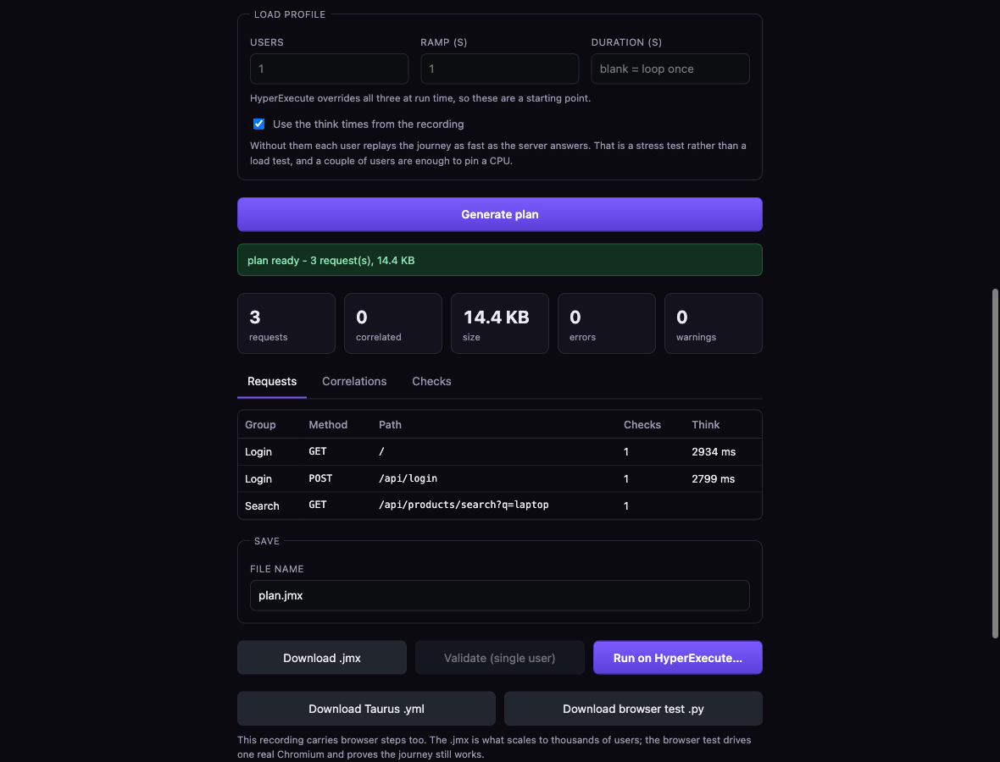

# Transactions, and what the report ends up calling things

A load-test report is only useful if you can read it. Two hundred rows of URLs
tell you the system is slow somewhere. Three rows named Login, Search and
Checkout tell you where.

That naming is decided while you record, in about three seconds per step, and
this page covers how.

## The two levels

A JMeter plan reports at two levels at once, and HyperExecute builds its filter
list from both.

**Samplers** are individual requests. `POST /api/login` is one sampler, with its
own response time, status code and assertions.

**Transactions** wrap a group of samplers and report the whole step as one
number. Login might be three requests; the transaction says what the user
experienced, which is the sum of them.

Both end up in the results file, so you get the end-to-end figure and the
breakdown underneath it. Verified on a generated plan:

```
rows: 5
  Home                       x 2     ← the transaction
  GET /                      x 1     ← its samplers
  POST /api/login            x 1
  GET /api/products/search   x 1
```

Two details make the transaction number honest. It is a real parent sample, so
its time is the sum of its children rather than a label on a chart. And think
times are excluded from it, so a two-second pause while you read a page is not
counted as two seconds of response time.

One thing to watch when reading totals: transaction rows are samples too, so
throughput and hit counts include them alongside the requests. Filter to the
sampler labels when you want raw request throughput.

## Naming the first step, before you start

Open the popup. Type the name in **Transaction**, press **Set**, then put the
URL in the box and press **Go**.



The order matters. Setting the name first is what puts request number one, the
initial navigation and any SSO redirect, inside the transaction. Press *Start
recording this tab* instead and you begin from whatever is already loaded, which
usually means the login is already over.

## Changing step while you browse

The panel is on the page, so you do not go back to the popup. Set the next name
and everything captured from that moment lands in the new controller.



```
Set "Login"     →  sign in
Set "Search"    →  run a search
Set "Checkout"  →  place the order
```

Three names, three transactions. This is the highest-value thing you can do
while recording, and the only one that has to happen while recording, because
nothing afterwards can tell which requests belonged to which step.

## Renaming a request

**Rename…** in the panel applies to the request you just made, so
`POST /api/v2/x7` becomes `Save timesheet`.

Do it for the handful that matter rather than all of them. An hour later nobody
remembers which one `x7` was, which is the whole argument for naming at the
moment of the click.

## What you get back

When recording finishes, the authoring page lists what each transaction caught,
and you can leave any of them out of this plan without re-recording.



Generate, and the Requests tab shows every sampler with the group it belongs to
and the think time that follows it.



Read this before you download anything. If the Group column is not what you
meant, the recording is still on disk, so you can author it again with different
transactions ticked.

## Matching a hand-built plan's step naming

A hand-written plan often names every UI action:

```
Step 01 - Open Login Page
Step 02 - Enter Username
Step 03 - Enter Password
Step 04 - Click Login Button
```

You can have that shape: put the step name in the Transaction field at each
step, rather than a journey name, and each becomes its own transaction row.

But expect fewer rows than a hand-built plan has, and this is not a shortcoming
to work around. *Enter Username* sends no HTTP request. A recording captures
traffic, so a step that only types into a field cannot become a sampler, and a
protocol plan that claimed otherwise would be lying about what it measures.
Those actions are not lost: they are in the Playwright script from the same
session, which is where a keystroke belongs.

The rule of thumb: name transactions after what the user is doing, not after
what the interface is doing. *Submit timesheet* is a step. *Click the third
tab* is not.

## When a transaction is not worth it

A transaction wrapping a single request tells you nothing the sampler did not
already say, and doubles the rows in the report. Reach for one when a step is
several requests, or when the business cares about the step as a unit.

## Repeats

*Collapse repeated requests into one sampler* is on by default. A poll called
four hundred times becomes one label rather than four hundred, which is almost
always what the report should say. If you expect forty rows and see one, this is
why. Requests count as repeats when the method, URL and body all match.
