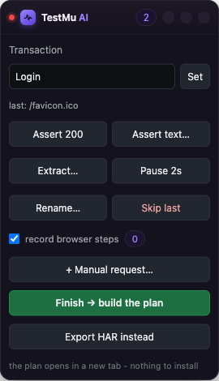
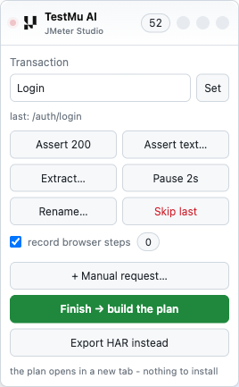
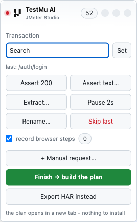
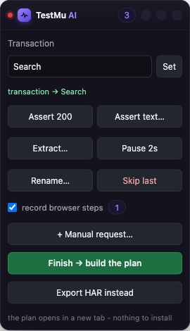
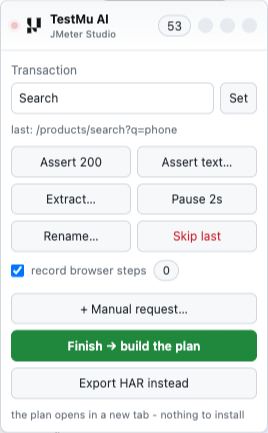

# Transactions, and what the report ends up calling things

A load-test report is only useful if you can read it. Two hundred rows of URLs
tell you the system is slow somewhere. Three rows named Login, Search and
Checkout tell you where.

That naming is decided while you record, in about three seconds per step, and
this page covers how.

## The two levels

A JMeter plan reports at two levels at once, and HyperExecute builds its filter
list from both.

**Samplers** are individual requests. `POST /api/login` is one sampler, with its
own response time, status code and assertions.

**Transactions** wrap a group of samplers and report the whole step as one
number. Login might be three requests; the transaction says what the user
experienced, which is the sum of them.

Both end up in the results file, so you get the end-to-end figure and the
breakdown underneath it. Verified on a generated plan:

```
rows: 5
  Home                       x 2     ← the transaction
  GET /                      x 1     ← its samplers
  POST /api/login            x 1
  GET /api/products/search   x 1
```

Two details make the transaction number honest. It is a real parent sample, so
its time is the sum of its children rather than a label on a chart. And think
times are excluded from it, so a two-second pause while you read a page is not
counted as two seconds of response time.

One thing to watch when reading totals: transaction rows are samples too, so
throughput and hit counts include them alongside the requests. Filter to the
sampler labels when you want raw request throughput.

## Naming the first step, before you start

Open the popup. Type the name in **Transaction**, press **Set**, then put the
URL in the box and press **Go**.


The order matters. Setting the name first is what puts request number one, the
initial navigation and any SSO redirect, inside the transaction. Press *Start
recording this tab* instead and you begin from whatever is already loaded, which
usually means the login is already over.

## Adding the next transaction, and the one after that

You do not go back to the popup. The panel that appears on the page is the
control, and its first field is Transaction with its own Set button.


The loop is the same for every step after the first.

**1. The first step is already running.** You named it in the popup before
pressing Go, so the panel opens showing it. Nothing has been captured yet.



**2. Do the step.** Sign in. The badge counts requests as they arrive, and the
line under the field names the last one, which is what Assert, Extract, Rename
and Skip act on.



**3. Type the next step's name.** Straight into the panel's Transaction field.
Nothing has changed yet: the name applies when you set it.



**4. Press Set.** The panel confirms it in green, and every request from this
moment lands in the new transaction.



**5. Do that step.** The requests it makes are now grouped under the new name.



Repeat 3 to 5 for as many steps as the journey has. There is no limit, and no
need to decide the list in advance.

```
Set "Login"     →  sign in
Set "Search"    →  run a search
Set "Checkout"  →  place the order
```

Three names, three transactions. This is the highest-value thing you can do
while recording, and the only one that *has* to happen while recording, because
nothing afterwards can tell which requests belonged to which step.

### Set the name before the traffic, not before the typing

This is the part that catches people out. Typing into a field sends no HTTP
request, so a transaction set around it captures nothing and never appears in
the plan.

```
Set "Login"        →  type the username, type the password, click Log in   ✅
Set "Timesheet"    →  open the timesheet page
Set "Save entry"   →  enter 8 hours, click Save
```

```
Set "Enter Username"   →  type into a box            ✗ captures nothing
Set "Enter Password"   →  type into a box            ✗ captures nothing
Set "Click Login"      →  click                      ← the login lands here
```

Both recordings involve the same clicks. The first produces three meaningful
transactions; the second produces one, with two empty names that are dropped.
Name the step for what the user is achieving, and set it just before the action
that talks to the server.

## Renaming a request

**Rename…** in the panel applies to the request you just made, so
`POST /api/v2/x7` becomes `Save timesheet`.

Do it for the handful that matter rather than all of them. An hour later nobody
remembers which one `x7` was, which is the whole argument for naming at the
moment of the click.

## What you get back

When recording finishes, the authoring page lists what each transaction caught,
and you can leave any of them out of this plan without re-recording.


Generate, and the Requests tab shows every sampler with the group it belongs to
and the think time that follows it.


Read this before you download anything. If the Group column is not what you
meant, the recording is still on disk, so you can author it again with different
transactions ticked.

## Matching a hand-built plan's step naming

A hand-written plan often names every UI action:

```
Step 01 - Open Login Page
Step 02 - Enter Username
Step 03 - Enter Password
Step 04 - Click Login Button
```

You can have that shape: put the step name in the Transaction field at each
step, rather than a journey name, and each becomes its own transaction row.

But expect fewer rows than a hand-built plan has, and this is not a shortcoming
to work around. *Enter Username* sends no HTTP request. A recording captures
traffic, so a step that only types into a field cannot become a sampler, and a
protocol plan that claimed otherwise would be lying about what it measures.
Those actions are not lost: they are in the Playwright script from the same
session, which is where a keystroke belongs.

The rule of thumb: name transactions after what the user is doing, not after
what the interface is doing. *Submit timesheet* is a step. *Click the third
tab* is not.

## From an automation session

A session you already ran is the one source where transactions arrive without
anybody naming them. The test's own steps become the transactions: where the run
reported step names, those are used verbatim; where it did not, each WebDriver
command is a boundary and the name comes from the request that step caused, so a
journey reads `Open common/home`, `Type into product/search`,
`Click checkout/cart/add`.

That is the same shape this page describes for a recording, arrived at from the
other end. [SESSIONS.md](SESSIONS.md) covers how it is decided and when it
cannot be.

## Every other source

A recording is the only source where you name steps as they happen. The rest
carry whatever structure the file already has, and that varies. Measured on the
sample files:

| Source | Transactions you get | To change them |
|---|---|---|
| Recording | the names you set while recording | set them in the panel; nothing afterwards can recover the grouping |
| Postman collection | one per folder, `Auth`, `Catalogue` | rename the folders in Postman, re-export |
| Excel / CSV sheet | one per value in the `transaction` column | edit the column; `thread_group` splits it further |
| cURL commands | a single group, `Flow` | see below |
| OpenAPI / Swagger | a single group, `API` | see below |
| URL list | one per page, plus an `Assets` group | — |
| Existing `.jmx` | whatever the plan already had, preserved | — |

**Postman and Excel are the two that carry real structure**, so if a team keeps
either, the report is already readable without anyone doing extra work. A
Postman folder called *Checkout* becomes a transaction called *Checkout*.

**cURL and OpenAPI have no notion of a journey.** A curl command is one
request, and a spec is an unordered catalogue of endpoints; neither knows which
calls belong together. So everything lands in one group, and that is honest
rather than lazy: inventing step boundaries from a spec would be guesswork
presented as fact.

If you need named steps from those two, the practical routes are to author from
the sheet instead, which costs a column, or to group in the plan afterwards.

Everything else on this page applies to all eight sources. Test data, the
authentication fields, the load profile and the run-time overrides do not care
where the requests came from, because by the time they are applied the source
has already become the same internal shape.

## When a transaction is not worth it

A transaction wrapping a single request tells you nothing the sampler did not
already say, and doubles the rows in the report. Reach for one when a step is
several requests, or when the business cares about the step as a unit.

## Repeats

*Collapse repeated requests into one sampler* is on by default. A poll called
four hundred times becomes one label rather than four hundred, which is almost
always what the report should say. If you expect forty rows and see one, this is
why. Requests count as repeats when the method, URL and body all match.
